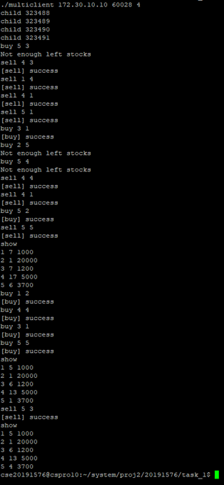
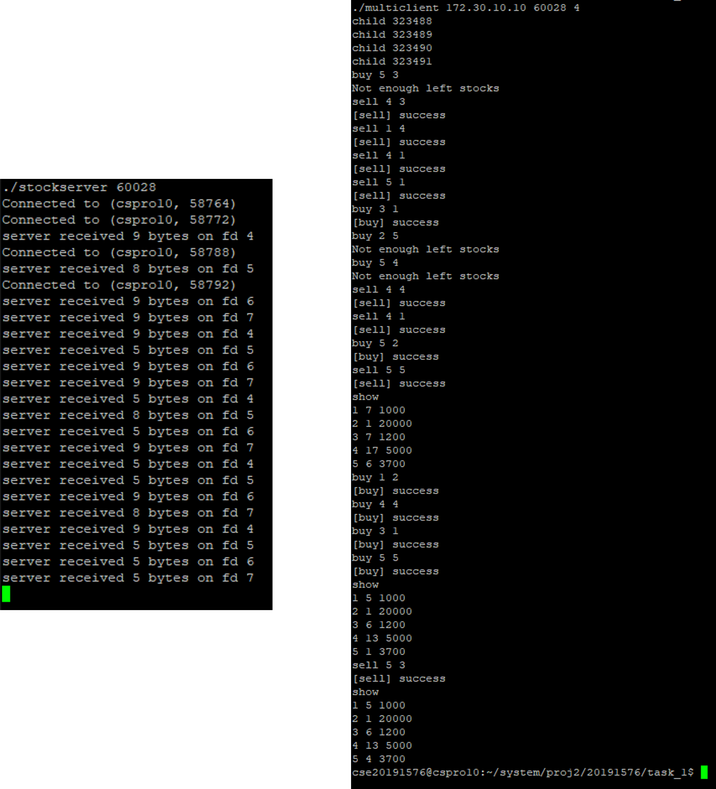
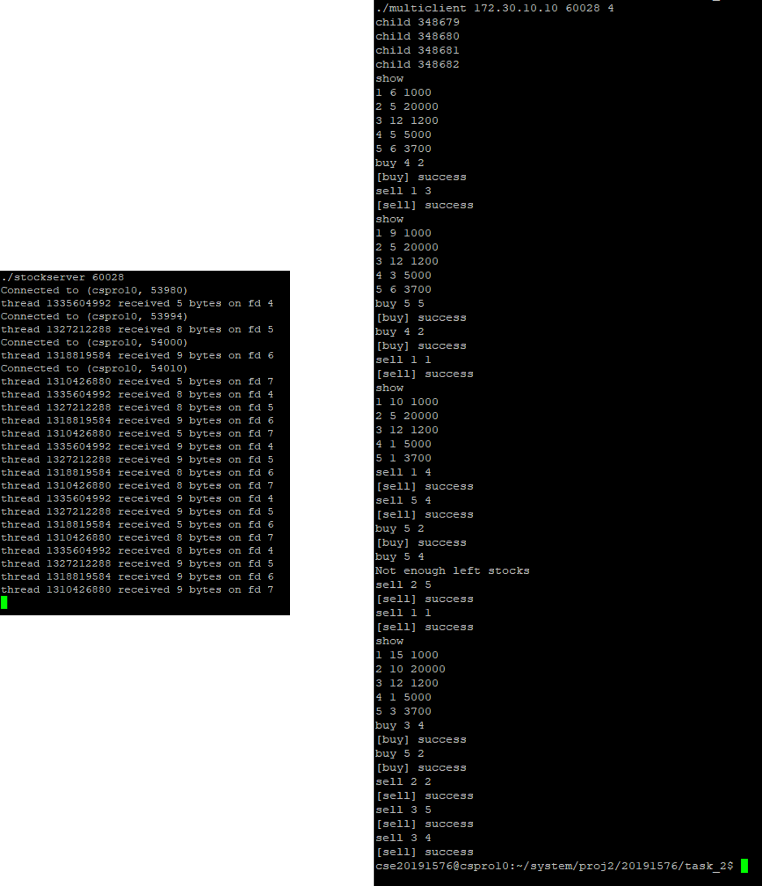

# Concurrent Stock Server

<br>

## 프로젝트 소개
- **개발 기간**   
  2023.05.14 ~ 2023.05.28
- **개발 환경**   
  Linux 4.4.0   
- **프로젝트 목적**   
  여러 클라이언트들의 동시 접속 및 서비스를 위한 Concurrent Stock Server를 Event-driven과 Thread-based 두 가지 방식으로 구축
- **주요 기술 및 도구**   
  - Concurrent Programming (C)
- **개발 내용**:
  - task_1과 task_2의 stockserver.c 작성

<br>

---

<br>

## 프로젝트 구조
```plaintext
├── task_1/
│   ├── csapp.c            # Wrapper 함수 정의
│   ├── csapp.h            # 헤더 파일
│   ├── echo.c             # echo Wrapper 함수 정의
│   ├── Makefile
│   ├── multiclient.c      # 단일 클라이언트 프로세스를 n개 생성하고, 각 프로세스는 주식 조회, 구매, 판매를 주어진 횟수만큼 임의 순서로 실행
│   ├── stock.txt          # 주식 데이터베이스
│   ├── stockclient.c      # 단일 클라이언트 프로세스를 생성하고, 주식 조회, 구매, 판매를 수행할 수 있음
│   ├── stockserver.c      # Event-driven으로 구현한 주식 서버
├── task_2/
│   ├── csapp.c            # Wrapper 함수 정의
│   ├── csapp.h            # 헤더 파일
│   ├── echo.c             # echo Wrapper 함수 정의
│   ├── Makefile
│   ├── multiclient.c      # 단일 클라이언트 프로세스를 n개 생성하고, 각 프로세스는 주식 조회, 구매, 판매를 주어진 횟수만큼 임의 순서로 실행
│   ├── stock.txt          # 주식 데이터베이스
│   ├── stockclient.c      # 단일 클라이언트 프로세스를 생성하고, 주식 조회, 구매, 판매를 수행할 수 있음
│   ├── stockserver.c      # Thread-based로 구현한 주식 서버
```

<br>

---

<br>

## 주요 기능 및 구조도
  
### 1. Client의 서버 연결
- **설명**:   
  Client가 Server에 연결하고 싶다는 의사를 표시하면, Server는 이를 연결하고 유지해야 한다.
- **주요 기술**:   
  - Event-driven   
    Event-driven Approach 기반 Server는 충분한 양의 pool을 생성하고 Client의 Connection 요청을 기다린다. 그리고 어떤 Client와의 Connection이 이루어졌을 때, 해당 Client의 connfd와 rio를 모두 pool에 저장해 놓는다.
  - Thread-based   
    Thread-based Approach 기반 Server는 충분한 양의 Worker Thread를 생성하고 Client의 Connection 요청을 기다린다. 그리고 어떤 Client와의 Connection이 이루어졌을 때, 해당 Client들의 connfd를 sbuf에 저장해 놓는다.
- **구현 방법**:
  - Event-driven
    ``` C
    int byte_cnt = 0;                           /* Counts total bytes received by server*/
    typedef struct {                            /* Represents a pool of connected descriptors */
        int maxfd;                                  /* Largest descriptor in read_set*/
        fd_set read_set;                            /* Set of all active descriptors */
        fd_set ready_set;                           /* Subset of descriptors ready for reading */
        int nready;                                 /* Number of ready descriptors from select */
        int maxi;                                   /* High water index into client array */
        int clientfd[FD_SETSIZE];                   /* Set of active descriptors */
        rio_t clientrio[FD_SETSIZE];                /* Set of active read buffers */
    } pool;
    ```
    위 코드는 pool 구조체의 정의이다. int형 배열 clientfd에 Client의 요청에 따른 connfd가 비어 있는 가장 빠른 index에 저장되고, rio_t형 배열 clientrio에 Client의 요청에 따른 rio가 비어 있는 가장 빠른 index에 저장된다.
    ``` C
    listenfd = Open_listenfd(argv[1]);
    init_pool(listenfd, &pool);
    
    while (1) {
        pool.ready_set = pool.read_set;     /* Wait for listening / connected descriptor(s) to become ready */
        pool.nready = Select(pool.maxfd + 1, &pool.ready_set, NULL, NULL, NULL);
  
        /* If listening descriptor is ready, add new client to pool */
        if (FD_ISSET(listenfd, &pool.ready_set)) {
            clientlen = sizeof(struct sockaddr_storage); 
            connfd = Accept(listenfd, (SA *)&clientaddr, &clientlen);
            Getnameinfo((SA *) &clientaddr, clientlen, client_hostname, MAXLINE, 
                        client_port, MAXLINE, 0);
            printf("Connected to (%s, %s)\n", client_hostname, client_port);
            add_client(connfd, &pool);
        }
    ```
    Server는 Open_listenfd() 함수를 통해 listenfd를 열고, init_pool() 함수를 통해 pool 구조체를 초기화한 뒤 Client를 대기한다. 이후 while문 안에서 Client의 Connection 요청이 오면 Accept() 함수를 통해 이를 수락하고, add_client() 함수를 이용해 해당 connfd를 pool에 저장한다.
     ``` C
    void add_client(int connfd, pool *p) {
        int i;
        p->nready--;
        /* Find an available slot */
        for (i = 0; i < FD_SETSIZE; i++) {
            /* If slot is empty */
            if (p->clientfd[i] < 0) {
                /* Add connected descriptor to the pool */
                p->clientfd[i] = connfd;
                Rio_readinitb(&p->clientrio[i], connfd);
    
                /* Add the descriptor to descriptor set */
                FD_SET(connfd, &p->read_set);
    
                /* Update max descriptor and pool high water mark */
                if (connfd > p->maxfd) {
                    p->maxfd = connfd;
                }
                if ( i > p->maxi) {
                    p->maxi = i;
                }
                break;
            }
        }
        
        /* Couldn't find an empty slot */
        if (i == FD_SETSIZE) {
            app_error("add_client error: Too many clients");
        }
    }
    ```
     add_client() 함수는 위와 같다. Server는 add_client() 함수를 통해 비어 있는 pool의 가장 작은 index에 connfd를 저장한다. 만약 더 이상 비어 있는 pool이 없다면 오류를 출력한다.
    
  - Thread-based   
    ``` C
    #define SBUFSIZE 1024
    typedef struct {
        int *buf;                                   /* Buffer array */
        int n;                                      /* Maximum number of slots */
        int front;                                  /* buf[(front + 1) % n] is the first item */
        int rear;                                   /* buf[rear % n] is the last item */
        sem_t mutex;                                /* Protects accesses to buf */
        sem_t slots;                                /* Counts available slots */
        sem_t items;                                /* Counts available items */
    } sbuf_t;
    ```
    위 코드는 sbuf 구조체의 정의이다. int*형 buf에 Client의 요청에 따른 connfd가 쌓이게 된다.
    ``` C
    listenfd = Open_listenfd(argv[1]);
    sbuf_init(&sbuf, SBUFSIZE);
    Sem_init(&file_mutex, 0, 1);
    
    // Create a pool of worker threads /
    for (int i = 0; i < SBUFSIZE; i++) {
        Pthread_create(&tid, NULL, thread, NULL);
    }
    
    while (1) {
        // If listening descriptor is ready, add new client to pool /
        clientlen = sizeof(struct sockaddr_storage);
        connfd = (int*)malloc(sizeof(int));
        *connfd = Accept(listenfd, (SA *)&clientaddr, &clientlen);
        Getnameinfo((SA *) &clientaddr, clientlen, client_hostname, MAXLINE, 
                    client_port, MAXLINE, 0);
        printf("Connected to (%s, %s)\n", client_hostname, client_port);
        // Insert connfd in buffer /
        sbuf_insert(&sbuf, *connfd);
    }
    exit(0);
    ```
    Master Thread는 Open_listenfd() 함수를 통해 listenfd를 열어 놓고 SBUFSIZE만큼 Worker Thread를 만들어 놓고 대기한다. 이후 while문 안에서 Client의 Connection 요청이 오면 Accept() 함수를 통해 이를 수락하고, sbuf에 해당 connfd를 저장한다.
### 2. Client의 서버 요청
- **설명**:   
  Client는 Server에게 주식 조회, 구매, 판매를 요청할 수 있다. 이때 Server는 요청을 수행하고 그에 따른 결과를 Client에게 전송해야 한다.
- **주요 기술**:   
  - Event-driven   
    어떤 Client와의 Connection이 이루어진 이후, Server는 pool의 read_set을 통해 Client의 요청을 인식하고 해당 Client의 요청을 수행하고 결과를 전송한다.
  - Thread-based   
    어떤 Client와의 Connection이 이루어진 이후, Server는 Worker Thread의 sbuf에 저장되어 있는 가장 오래된 connfd를 하나 꺼내어 Client의 요청을 인식하고 해당 Client의 요청을 수행하고 결과를 전송한다.
- **구현 방법**:
  - Event-driven   
    ``` C
    for(int i = 0; (i <= pool.maxi) && (pool.nready > 0); i++) {
          connfd = pool.clientfd[i];
          rio = pool.clientrio[i];
      
          /* If the descriptor is ready, echo a text line from it */
          if ((connfd > 0) && (FD_ISSET(connfd, &pool.ready_set))) {
              pool.nready--;
      
              if ((n = Rio_readlineb(&rio, buf, MAXLINE)) != 0) {
                  byte_cnt += n;
                  printf("server received %d bytes on fd %d\n", n, connfd);
                  if (!strncmp(buf, "show", 4)) {
                      sprint_Node(root, buf);
                  }
                  else if(!strncmp(buf, "buy", 3)) {
                      int buy_ID, buy_amount;
                      sscanf(buf, "%*s %d %d\n", &buy_ID, &buy_amount);
      
                      ptr = search_Node(root, buy_ID);
                      sem_wait(&ptr->mutex);
                      if (ptr->left_stock >= buy_amount) {
                          ptr->left_stock -= buy_amount;
                          strcat(buf, "[buy] success\n");
                      }
                      else {
                          strcat(buf, "Not enough left stocks\n");
                      }
                      sem_post(&ptr->mutex);
                  }
                  else if (!strncmp(buf, "sell", 4)) {
                      int sell_ID, sell_amount;
                      sscanf(buf, "%*s %d %d\n", &sell_ID, &sell_amount);
      
                      ptr = search_Node(root, sell_ID);
                      sem_wait(&ptr->mutex);
                      ptr->left_stock += sell_amount;
                      strcat(buf, "[sell] success\n");
                      sem_post(&ptr->mutex);
                  }
                  Rio_writen(connfd, buf, MAXLINE);
              }
              /* EOF detected, remove descriptor from pool */
              else {
                  sem_wait(&file_mutex);
                  fp = fopen("stock.txt", "w");
                  fprint_Node(root, fp);
                  fclose(fp);
                  sem_post(&file_mutex);
      
                  Close(connfd);
                  FD_CLR(connfd, &pool.read_set);
                  pool.clientfd[i] = -1;
              }
          }
      }
    ```
    connfd를 pool에 저장한 이후, Server는 pool을 순회하며 각각의 index에 저장되어 있는 connfd와 rio를 꺼내 Client의 요청을 받게 된다. Client의 요청을 수행할 때 발생할 수 있는 동시성 문제는 semaphore를 사용해 해결한다. Client의 요청에 대한 Server의 수행이 끝나면, Rio_writen을 통해 Client에게 해당 요청의 결과를 보내주게 된다. Client의 요청에 알맞은 수행을 하고 난 뒤에도 connfd와 rio는 해당 Client의 다음 요청을 수행하기 위해 삭제하지 않는다.
  - Thread-based
    ``` C
    void *thread(void *vargp) {
        Pthread_detach(pthread_self());
        while(1) {
            /* Remove connfd from buf */
            int connfd = sbuf_remove(&sbuf);
            /* Service Client */
            //echo_cnt(connfd);
            int n;
            char buf[MAXLINE];
            rio_t rio;
            itemNode* ptr;
    
            Rio_readinitb(&rio, connfd);
            while((n = Rio_readlineb(&rio, buf, MAXLINE)) != 0) {
                printf("thread %d received %d bytes on fd %d\n", (int)pthread_self(), n, connfd);
                if (!strncmp(buf, "show", 4)) {
                    sprint_Node(root, buf);
                }
                else if(!strncmp(buf, "buy", 3)) {
                    int buy_ID, buy_amount;
                    sscanf(buf, "%*s %d %d\n", &buy_ID, &buy_amount);
    
                    ptr = search_Node(root, buy_ID);
                    //sem_wait(&Node[i].mutex);
                    P(&ptr->mutex);
                    if (ptr->left_stock >= buy_amount) {
                        ptr->left_stock -= buy_amount;
                        strcat(buf, "[buy] success\n");
                    }
                    else {
                        strcat(buf, "Not enough left stocks\n");
                    }
                    //sem_post(&Node[i].mutex);
                    V(&ptr->mutex);
                }
                else if (!strncmp(buf, "sell", 4)) {
                    int sell_ID, sell_amount;
                    sscanf(buf, "%*s %d %d\n", &sell_ID, &sell_amount);
    
                    ptr = search_Node(root, sell_ID);
                    //sem_wait(&Node[i].mutex);
                    P(&ptr->mutex);
                    ptr->left_stock += sell_amount;
                    strcat(buf, "[sell] success\n");
                    //sem_post(&Node[i].mutex);
                    V(&ptr->mutex);
                }
                Rio_writen(connfd, buf, MAXLINE);
            }
            /* EOF detected, remove descriptor from pool */
            P(&file_mutex);
            fp = fopen("stock.txt", "w");
            fprint_Node(root, fp);
            fclose(fp);
            V(&file_mutex);
    
            Close(connfd);
        }
    }
    ```
    Worker Thread는 sbuf_remove() 함수를 통해 sbuf의 가장 오래된 connfd를 꺼내고 rio를 통해 Client의 요청을 받게 된다. Client의 요청을 수행할 때 발생할 수 있는 동시성 문제는 mutex를 사용해 해결한다. Client의 요청에 대한 Server의 수행이 끝나면, Rio_writen() 함수를 통해 Client에게 해당 요청의 결과를 보내주게 된다. 이후 Worker Thread는 수행이 끝난 connfd를 삭제함으로써 Client의 요청을 마무리 짓는다.
<br>

---

<br>

## 데모
- **스크린샷**:   
     
  (좌: Server, 우: Client)   
  4개의 Client가 Server에 접속하여 여러 요청을 처리하는 모습이다.   
     
  (좌: Server, 우: Client)   
  4개의 Client가 Server에 접속하여 여러 요청을 처리하는 모습이다.
- **보고서**:   
  
