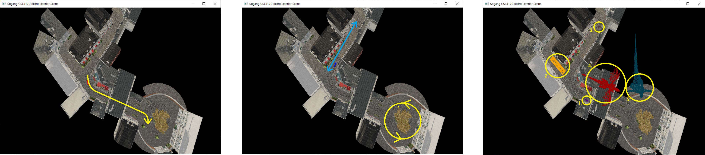
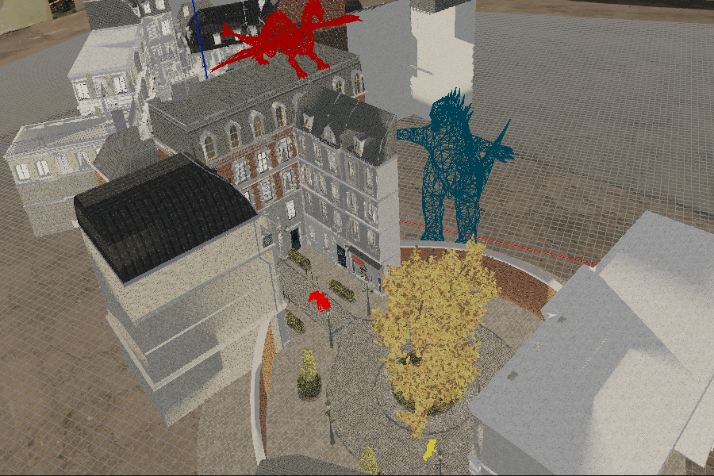
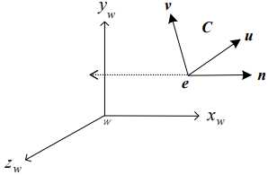

# OpenGL 3D Viewing

<br>

## 프로젝트 소개
- **개발 기간**   
  2023.05.15 ~ 2023.05.22   
- **개발 환경**   
  Visual Studio 2022   
  OpenGL 4.6   
- **프로젝트 목적**   
    서강대학교의 기초컴퓨터그래픽스 과목을 수강하며 학습한 내용을 바탕으로, OpenGL에서 3D Viewing을 진행해봄으로써 래스터화 기반의 실시간 랜더링 파이프라인에 관한 이해도를 높인다.
- **주요 기술 및 도구**
  - OpenGL 4.6
  - BistroExterior Texture PS GLSL (3D 장면 데이터)
- **개발 내용**   
    이용한 오브젝트의.cpp, CallBack.cpp, Camera.cpp, DrawScene.cpp 작성


<br>

---

<br>

## 프로젝트 구조
```plaintext
├── data/
│   ├── dynamic_objects/        # 동적 3D 오브젝트들을 저장
│   │   ├── ben/
│   │   │   ├── Ben.h           # 키프레임 변수를 정의, 함수 선언
│   │   │   ├── Ben.cpp         # 오브젝트 초기화와 배치와 관련된 함수 정의
│   │   ├── tiger/
│   │   │   ├── Tiger.h         # 키프레임 변수를 정의, 함수 선언
│   │   │   ├── Tiger.cpp       # 오브젝트 초기화와 배치와 관련된 함수 정의
│   │   ├── wolf/
│   │   │   ├── Wolf.h          # 키프레임 변수를 정의, 함수 선언
│   │   │   ├── Wolf.cpp        # 오브젝트 초기화와 배치와 관련된 함수 정의
│   ├── static_objects/         # 정적 3D 오브젝트들을 저장
│   │   ├── bike/
│   │   │   ├── Bike.h          # 키프레임 변수를 정의, 함수 선언
│   │   │   ├── Bike.cpp        # 오브젝트 초기화와 배치와 관련된 함수 정의
│   │   ├── bus/
│   │   │   ├── Bus.h           # 키프레임 변수를 정의, 함수 선언
│   │   │   ├── Bus.cpp         # 오브젝트 초기화와 배치와 관련된 함수 정의
│   │   ├── cow/
│   │   │   ├── Cow.h           # 키프레임 변수를 정의, 함수 선언
│   │   │   ├── Cow.cpp         # 오브젝트 초기화와 배치와 관련된 함수 정의
│   │   ├── dragon/
│   │   │   ├── Dragon.h        # 키프레임 변수를 정의, 함수 선언
│   │   │   ├── Dragon.cpp      # 오브젝트 초기화와 배치와 관련된 함수 정의
│   │   ├── godzilla/
│   │   │   ├── Godzilla.h      # 키프레임 변수를 정의, 함수 선언
│   │   │   ├── Godzilla.cpp    # 오브젝트 초기화와 배치와 관련된 함수 정의
│   ├── Data.h
│   ├── Data.cpp                # 해당 objects를 읽어오는 read_geometry() 함수 정의
├── geometry/                   # BistroExterior Texture PS GLSL 3D 장면 데이터
├── src/
│   ├── CallBack.h
│   ├── CallBack.cpp            # 콜백 함수 정의
│   ├── Camera.h
│   ├── Camera.cpp              # 카메라 이동 및 회전 관련 함수 정의
│   ├── DrawScene.h
│   ├── DrawScene.cpp           # OpenGL 초기화 관련 함수 정의
│   ├── Geometry.h
│   ├── Geometry.cpp            # Geometry 관련 행렬과 변수 선언
│   ├── LoadScene.h
│   ├── LoadScene.cpp           # Scene을 불러오거나 메모리를 해제
│   ├── main.cpp                # LoadScene을 이용해 Scene을 불러옴
│   ├── Shader.h
│   ├── Shader.cpp              # 쉐이더 관련 함수 정의
│   ├── ShadingInfo.h           # 빛과 머티리얼 관련 구조체 변수 선언
```

<br>

---

<br>

## 주요 기능 및 구조도
### 1. 물체의 배치 및 움직임   
  
  <p align="center">
    
    
  </p>
  
- **설명**:   
  맵에 tiger, ben, wolf 총 3개의 동적 오브젝트와 bike, bus, cow , dragon, dogzilla 총 5개의 정적 오브젝트가 배치되어 있다. 동적 오브젝트는 각자 고유한 경로를 따라 움직인다. 그 중 호랑이는 키보드 'r' 키를 눌러 움직임과 멈춤을 조절할 수 있다. 
- **주요 기술**:   
  미리 정의되어 있는 오브젝트 정보를 바탕으로 VBO 및 VAO를 활용해 오브젝트를 초기화한다. 이후 아핀 변환을 이용해 물체를 변환시키고 VAO를 이용해 오브젝트를 그리게 된다.
- **구현 방법**:   
  - prepare() 함수   
    각 오브젝트.cpp 파일의 prepare() 함수에서 오브젝트를 사용하기 위한 초기화를 진행한다.
    ``` C++
    n_bytes_per_vertex = 8 * sizeof(float); // 3 for vertex, 3 for normal, and 2 for texcoord
    n_bytes_per_triangle = 3 * n_bytes_per_vertex;
    ```
    vertex 하나에는 3개의 정점 좌표(x, y, z), 법선 벡터를 나타내는 3개의 좌표, 그리고 2개의 텍스처 좌표가 담겨 있다. triangle은 3개의 vertex가 모여 만들어지므로 vertex의 크기에 3을 곱한다.
    ``` C++
    for (i = 0; i < N_TIGER_FRAMES; i++) {
  		sprintf(filename, "Data/dynamic_objects/tiger/Tiger_%d%d_triangles_vnt.geom", i / 10, i % 10);
  		tiger_n_triangles[i] = read_geometry(&tiger_vertices[i], n_bytes_per_triangle, filename);
  		// assume all geometry files are effective
  		tiger_n_total_triangles += tiger_n_triangles[i];
  
  		if (i == 0)
  			tiger_vertex_offset[i] = 0;
  		else
  			tiger_vertex_offset[i] = tiger_vertex_offset[i - 1] + 3 * tiger_n_triangles[i - 1];
  	}
    ```
    파일로부터 정점 정보를 불러와 메모리에 저장한다.
    ``` C++
    // initialize vertex buffer object
    glGenBuffers(1, &tiger_VBO);
    
    glBindBuffer(GL_ARRAY_BUFFER, tiger_VBO);
    glBufferData(GL_ARRAY_BUFFER, tiger_n_total_triangles * n_bytes_per_triangle, NULL, GL_STATIC_DRAW);
    ```
    오브젝트 데이터를 GPU에 올리기 위해 Vertex Buffer Object를 초기화하고 할당한다.
    ``` C++
    for (i = 0; i < N_TIGER_FRAMES; i++)
  	glBufferSubData(GL_ARRAY_BUFFER, tiger_vertex_offset[i] * n_bytes_per_vertex,
  		tiger_n_triangles[i] * n_bytes_per_triangle, tiger_vertices[i]);
  
    // as the geometry data exists now in graphics memory, ...
    for (i = 0; i < N_TIGER_FRAMES; i++)
    	free(tiger_vertices[i]);
    ```
    이제 오브젝트 데이터를 GPU에 업로드하고, 메모리에 할당되어 있는 vertex의 정보는 모두 해제한다.
  
    ``` C++
    // initialize vertex array object
    glGenVertexArrays(1, &tiger_VAO);
    glBindVertexArray(tiger_VAO);
    
    glBindBuffer(GL_ARRAY_BUFFER, tiger_VBO);
    glVertexAttribPointer(LOC_VERTEX, 3, GL_FLOAT, GL_FALSE, n_bytes_per_vertex, BUFFER_OFFSET(0));
    glEnableVertexAttribArray(0);
    glVertexAttribPointer(LOC_NORMAL, 3, GL_FLOAT, GL_FALSE, n_bytes_per_vertex, BUFFER_OFFSET(3 * sizeof(float)));
    glEnableVertexAttribArray(1);
    glVertexAttribPointer(LOC_TEXCOORD, 2, GL_FLOAT, GL_FALSE, n_bytes_per_vertex, BUFFER_OFFSET(6 * sizeof(float)));
    glEnableVertexAttribArray(2);
    
    glBindBuffer(GL_ARRAY_BUFFER, 0);
    glBindVertexArray(0);
    ```
    VBO를 이용해 Vertex Array Object를 초기화하고 할당한다. 이후 정점의 위치 정보, 법선 벡터 정보, 텍스처 정보를 모두 저장하고 VBO와 VAO를 모두 할당 해제한다. 이미 데이터를 저장했으므로 렌더링 시 VAO만 활성화하면 되므로 성능이 향상된다.   

  - draw() 함수   
    각 오브젝트.cpp 파일의 draw() 함수에서 오브젝트를 그리기 위한 계산을 진행한다.
    ``` C++
    if (KEY_FRAME_1 <= timestamp_tiger && timestamp_tiger < KEY_FRAME_2) {
      ModelViewMatrix = glm::rotate(ViewMatrix, rotation_angle_tiger, glm::vec3(0.0f, 0.0f, 1.0f));
      ModelViewMatrix = glm::translate(ModelViewMatrix, glm::vec3(-750.0f, 0.0f, 0.0f));
      ModelViewMatrix = glm::scale(ModelViewMatrix, glm::vec3(2.0f, 2.0f, 2.0f));
    }
    else if (KEY_FRAME_2 <= timestamp_tiger && timestamp_tiger < KEY_FRAME_3) {
      ModelViewMatrix = glm::translate(ViewMatrix, glm::vec3(cos((90 - KEY_FRAME_2) * TO_RADIAN) * tiger_velocity * (timestamp_tiger - KEY_FRAME_2),
                                   -sin((90 - KEY_FRAME_2) * TO_RADIAN) * tiger_velocity * (timestamp_tiger - KEY_FRAME_2),
                                   0.0f));
      ModelViewMatrix = glm::rotate(ModelViewMatrix, KEY_FRAME_2 * TO_RADIAN, glm::vec3(0.0f, 0.0f, 1.0f));
      ModelViewMatrix = glm::translate(ModelViewMatrix, glm::vec3(-750.0f, 0.0f, 0.0f));
      ModelViewMatrix = glm::scale(ModelViewMatrix, glm::vec3(2.0f, 2.0f, 2.0f));
    }
    else if (KEY_FRAME_3 <= timestamp_tiger && timestamp_tiger < KEY_FRAME_4) {
      int radius = 600;
      ModelViewMatrix = glm::translate(ViewMatrix, glm::vec3(cos((90 - KEY_FRAME_2) * TO_RADIAN) * tiger_velocity * (KEY_FRAME_3 - KEY_FRAME_2) - (2 * radius + (tiger_velocity / TO_RADIAN - radius)) * cos(KEY_FRAME_2 * TO_RADIAN),
                                   -sin((90 - KEY_FRAME_2) * TO_RADIAN) * tiger_velocity * (KEY_FRAME_3 - KEY_FRAME_2) - (2 * radius + (tiger_velocity / TO_RADIAN - radius)) * sin(KEY_FRAME_2 * TO_RADIAN),
                                   0.0f));
      ModelViewMatrix = glm::rotate(ModelViewMatrix, KEY_FRAME_2 * TO_RADIAN - rotation_angle_tiger, glm::vec3(0.0f, 0.0f, 1.0f));
      ModelViewMatrix = glm::translate(ModelViewMatrix, glm::vec3(radius, 0.0f, 0.0f));
      ModelViewMatrix = glm::scale(ModelViewMatrix, glm::vec3(2.0f, 2.0f, 2.0f));
    }
    ```
    오브젝트의 키 프레임에 따라 아핀 변환을 정의한다. 키 프레임 정보는 각 오브젝트의 .h 파일에 선언되어 있다.
    ``` C++
    ModelViewProjectionMatrix = ProjectionMatrix * ModelViewMatrix;
    ModelViewMatrixInvTrans = glm::inverseTranspose(glm::mat3(ModelViewMatrix));
    ```
    각 키 프레임에 해당하는 오브젝트의 변환 행렬이 준비되었으면, ModelViewMatrix를 월드 좌표에서 클립 좌표로 변환한다. 그리고 법선 벡터를 변환하기 위해 역행렬의 전치 행렬을 계산한다.
    ``` C++
    glUniformMatrix4fv(loc_ModelViewProjectionMatrix, 1, GL_FALSE, &ModelViewProjectionMatrix[0][0]);
    glFrontFace(GL_CCW);
    glPolygonMode(GL_FRONT_AND_BACK, GL_LINE);
    glUniform3fv(loc_primitive_color, 1, tiger_color);
    ```
    이제 쉐이더에 변환 행렬을 전달하고, 반시계 방향(Counter-Clock-Wise)로 정의된 삼각형을 tiger_color 색상의 와이어프레임으로 그리도록 설정한다.
  
    ``` C++
    glBindVertexArray(tiger_VAO);
    glDrawArrays(GL_TRIANGLES, tiger_vertex_offset[cur_frame_tiger], 3 * tiger_n_triangles[cur_frame_tiger]);
    glBindVertexArray(0);
    ```
    prepare() 함수에서 초기화한 VAO를 활용해 오브젝트를 그리게 된다.
  
### 2. 가상 카메라의 배치 및 조절   
  <p align="center">
    
    
  </p>
  
- **설명**:   
  세상을 관찰할 수 있는 총 4개의 고정된 가상 카메라가 맵에 배치되어 있다. 각각의 가상 카메라는 키보드 'u', 'i', 'o', 'p'를 눌러 전환할 수 있다. 이때 키보드 'CTRL' 키를 누른 상태에서 마우스 스크롤 휠을 이용해 줌-인과 줌-아웃할 수 있다.
  
- **설명**:   
  세상을 자유롭게 이동할 수 있는 1개의 가상 카메라가 맵에 배치되어 있다. 이 가상 카메라는 키보드 'a'키를 눌러 전환할 수 있다. 이때 키보드 좌/우 키를 누르면 카메라가 좌/우로 이동한다. 또한 키보드 상/하 키를 누르면 카메라가 전/후로 이동한다. 마지막으로 키보드 'z'/'c' 키를 누르면 카메라가 상/하로 이동한다.
  
- **설명**:   
  세상을 자유롭게 이동할 수 있는 가상 카메라는 회전도 가능하다. 키보드 'shift' 키를 누른 상태에서 좌/우 키를 누르면 카메라가 좌/우(Yaw)로 회전한다. 또한 키보드 'shift' 키를 누른 상태에서 상/하 키를 누르면 카메라가 전/후(Pitch)로 회전한다. 마지막으로 키보드 'shift'키를 누른 상태에서 'z'/'c' 키를 누르면 카메라가 좌/우(Pitch)로 회전한다.
  
- **설명**:   
  호랑이의 눈에 배치된 가상 카메라와 호랑이의 뒤에 배치된 가상 카메라가 맵에 배치되어 호랑이의 움직임을 따라다니고 있다. 각각의 가상 카메라는 키보드 't'와 'g'를 눌러 전환할 수 있다. 
- **주요 기술**: OpenGL의 세상 좌표계와 눈 좌표계를 이용해 가상 카메라의 좌표를 변화시킨다.
- **구현 방법**:   
  - 가상 카메라 배치   
       
    OpenGL에서 세상 좌표계는 w로 표현하고, 맵에 고정되어 있는 좌표계이다. 눈 좌표계(카메라)는 e로 표현하고, 카메라의 좌표계이다. 세상 좌표계와 눈 좌표계를 이용해 위의 기능들을 구현할 수 있다.
    ``` C
    //bistro left view
    //CAMERA_U : Bistro Static Camera 1 (Original View)
    pCamera = &camera_info[CAMERA_U];
    pCamera->pos[0] = -1715.251709f; pCamera->pos[1] = 249.633179f; pCamera->pos[2] = 486.491394f;
    pCamera->uaxis[0] = -0.266408f; pCamera->uaxis[1] = -0.963670f; pCamera->uaxis[2] = 0.019177f;
    pCamera->vaxis[0] = 0.205614f; pCamera->vaxis[1] = -0.037383f; pCamera->vaxis[2] = 0.977912f;
    pCamera->naxis[0] = -0.941668f; pCamera->naxis[1] = 0.264468f; pCamera->naxis[2] = 0.208104f;
    pCamera->move = 0;
    pCamera->fovy = 46 * TO_RADIAN, pCamera->aspect_ratio = scene.camera.aspect, pCamera->near_c = 0.1f; pCamera->far_c = 50000.0f;
    ```
    Camera.cpp의 initialize_camera() 함수에 각 가상 카메라의 위치 정보가 저장되어 있다.
    ``` C++
    switch (key) {
    ...
    //CAMERA_U : Static Camera 1 (Original View)
    case 'u':
    case 'U':
    	set_current_camera(CAMERA_U);
    	current_camera_type = CAMERA_U;
    	glutPostRedisplay();
    	break;
    ...
    }
    ```
    OpenGL에 등록되어 있는 콜백 함수인 keyboard() 함수 내부에서 키보드의 특정 키를 입력하면 현재 카메라의 위치 정보를 담고 있는 변수에 그에 해당하는 가상 카메라의 위치 정보를 덮어 씌운다. 그럼 해당하는 카메라가 바라보는 세상이 화면에 출력된다.
  - 줌-인/줌-아웃   
    ``` C++
    switch (button) {
    	//Camera Zoom-In
    case GLUT_WHEEL_UP:
    	current_camera.fovy -= 1 * TO_RADIAN;
    	if (current_camera.fovy < MIN_FOV * TO_RADIAN) {
    		current_camera.fovy = MIN_FOV * TO_RADIAN;
    	}
    ...
    }
    ```
    OpenGL에 등록되어 있는 콜백 함수인 mousepress() 함수 내부에서 마우스 휠의 입력에 따라 카메라의 FOV 값을 변화시킨다. 그럼 줌-인 또는 줌-아웃 효과를 구현할 수 있다.
  - 카메라 이동 및 회전
    ``` C++
    void special(int key, int x, int y) {
    if (current_camera.move == 1) {
    ...
    }
    else {
      //Camera Translation
      switch (key) {
        //Camera Move Left via Camera's u-Axis
      case GLUT_KEY_LEFT:
        current_camera.pos[0] -= 50 * current_camera.uaxis[0] / sqrt(pow(current_camera.uaxis[0], 2) + pow(current_camera.uaxis[1], 2) + pow(current_camera.uaxis[2], 2));
        current_camera.pos[1] -= 50 * current_camera.uaxis[1] / sqrt(pow(current_camera.uaxis[0], 2) + pow(current_camera.uaxis[1], 2) + pow(current_camera.uaxis[2], 2));
        current_camera.pos[2] -= 50 * current_camera.uaxis[2] / sqrt(pow(current_camera.uaxis[0], 2) + pow(current_camera.uaxis[1], 2) + pow(current_camera.uaxis[2], 2));
        set_ViewMatrix_from_camera_frame();
        ViewProjectionMatrix = ProjectionMatrix * ViewMatrix;
        glutPostRedisplay();
        break;
    ...
    }
    ```
    OpenGL에 등록되어 있는 콜백 함수인 special() 함수 내부에서 shift 키의 입력 여부와 방향키의 입력에 따라 가상 카메라의 좌표를 변화시킨다. 예를 들어 위의 코드에서는 Shift 키를 누르지 않은 상태로 왼쪽 방향키를 눌렀을 때의 상황이다.
    ``` C++
    current_camera.pos[0] -= 50 * current_camera.uaxis[0] / sqrt(pow(current_camera.uaxis[0], 2) + pow(current_camera.uaxis[1], 2) + pow(current_camera.uaxis[2], 2));
    current_camera.pos[1] -= 50 * current_camera.uaxis[1] / sqrt(pow(current_camera.uaxis[0], 2) + pow(current_camera.uaxis[1], 2) + pow(current_camera.uaxis[2], 2));
    current_camera.pos[2] -= 50 * current_camera.uaxis[2] / sqrt(pow(current_camera.uaxis[0], 2) + pow(current_camera.uaxis[1], 2) + pow(current_camera.uaxis[2], 2));
    ```
    현재 카메라의 좌표를 u-축의 방향으로 감소시키면 좌로 이동을 구현할 수 있다.
    ``` C++
    result = glm::rotate(current_camera_axis, TO_RADIAN, glm::vec3(current_camera.vaxis[0], current_camera.vaxis[1], current_camera.vaxis[2]));
    ```
    현재 카메라의 좌표를 v 좌표축의 방향으로 1도씩 회전시키면 Yaw 회전을 구현할 수 있다.
    ``` C++
    void special(int key, int x, int y) {
    	if (current_camera.move == 1) {
    		//Camera Rotation
    		if (glutGetModifiers() == GLUT_ACTIVE_SHIFT) {
    			glm::mat4 current_camera_axis;
    			glm::mat4 result;
    			current_camera_axis = glm::mat4(current_camera.uaxis[0], current_camera.vaxis[0], current_camera.naxis[0], 0.0f,
    											current_camera.uaxis[1], current_camera.vaxis[1], current_camera.naxis[1], 0.0f,
    											current_camera.uaxis[2], current_camera.vaxis[2], current_camera.naxis[2], 0.0f,
    											0.0f, 0.0f, 0.0f, 1.0f);
    			switch (key) {
    			//Camera Rotate Left around Camera's v-Axis
    			case GLUT_KEY_LEFT:
    				result = glm::rotate(current_camera_axis, TO_RADIAN, glm::vec3(current_camera.vaxis[0], current_camera.vaxis[1], current_camera.vaxis[2]));
    				current_camera.uaxis[0] = result[0][0];
    				current_camera.uaxis[1] = result[1][0];
    				current_camera.uaxis[2] = result[2][0];
    				current_camera.naxis[0] = result[0][2];
    				current_camera.naxis[1] = result[1][2];
    				current_camera.naxis[2] = result[2][2];
    				set_ViewMatrix_from_camera_frame();
    				ViewProjectionMatrix = ProjectionMatrix * ViewMatrix;	
    				glutPostRedisplay();
    				break;
    ...
    }
    ```
    OpenGL에 등록되어 있는 콜백 함수인 special() 함수 내부에서 shift 키의 입력 여부와 방향키의 입력에 따라 가상 카메라의 좌표를 변화시킨다. 예를 들어 위의 코드에서는 Shift 키를 누른 상태로 왼쪽 방향키를 눌렀을 때의 상황이다.
    ``` C++
    result = glm::rotate(current_camera_axis, TO_RADIAN, glm::vec3(current_camera.vaxis[0], current_camera.vaxis[1], current_camera.vaxis[2]));
    ```
    현재 카메라의 좌표를 v-축의 방향으로 1도씩 회전시키면 Yaw 회전을 구현할 수 있다.
<br>

---

<br>

## 데모
- **YouTube 링크**: [프로젝트 데모 보기](https://www.youtube.com/watch?v=TaTx-juZHFY)
