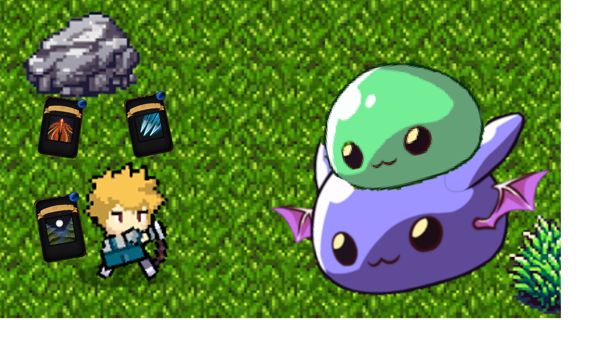
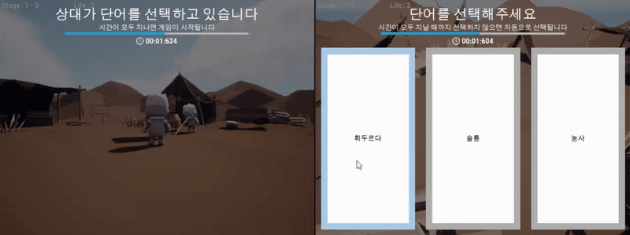
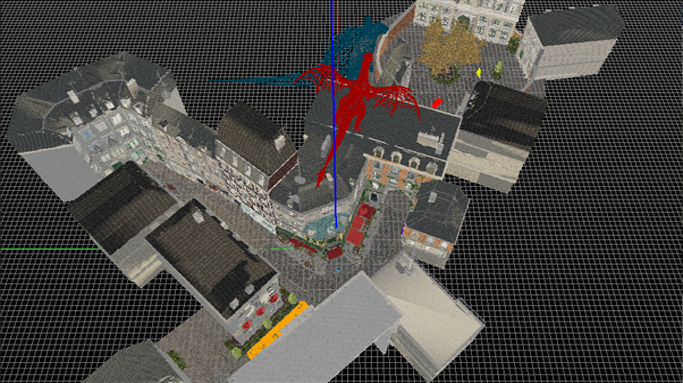
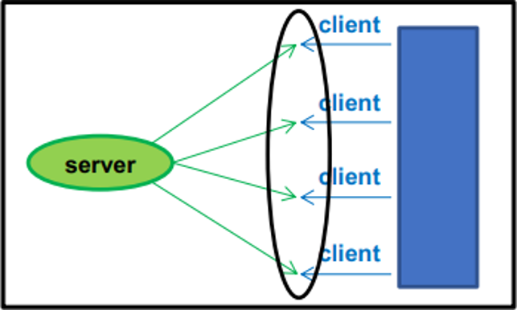

# 김윤성의 포트폴리오
안녕하세요, 게임 클라이언트 프로그래머를 지망하고 있는 김윤성이라고 합니다.   

어릴 적부터 게임은 제 삶의 큰 즐거움이자 영감을 주는 원천이었습니다.   
게임이 선사하는 행복과 아름다움에 매료되어 자연스럽게 게임 개발이라는 길을 선택하게 되었습니다.   
아직 부족한 점도 많지만, 끊임없이 배우고 성장하며 더 많은 사람들에게 기쁨과 감동을 전할 수 있는 게임을 만들고 싶습니다.    
그날까지 열정을 다해 노력하겠습니다.   

 

## About Me
### 이름  
  - 김윤성   
  
### 학력   
  - 2019.03 ~ 2025.02   
  서강대학교 컴퓨터공학과 졸업예정   
  
### 기술 스택 
- Unreal 5   
- Unity 5   
- C   
- C++

 

## Project List
다음은 본 포트폴리오에서 소개하는 저의 프로젝트들의 목록입니다.
### [1. 팀 프로젝트](#팀-프로젝트)
1-1. [Project_HAL](#1-project_hal)
1-2. [Squire](#2-squire)   
### [2. 개인 프로젝트](#개인-프로젝트)
2-1. [OpenGL 3D Viewing](#1-opengl-3d-viewing)
2-2. [Concurrent Stock Server](#2-concurrent-stock-server)   
  
 

---

 

# [팀 프로젝트](#1-팀_프로젝트)
팀 단위로 진행한 게임 개발 프로젝트들을 기록하는 곳입니다.   
## [1. Project_HAL](#project-list)  

- **설명**:   
  Unity Game Engine을 이용하여 제작한 간단한 탑뷰 솔로플레이 2D 게임입니다.
- **개발 환경 및 언어**:   
  Unity 2022.3.21f, C#
- **주요 기능 및 이미지**:
  - 캐릭터 이동 및 캔슬   
  
  
  - 상호작용   
  
  
  - 아이템 습득, 폐기 및 이동   
  

- **More**:   
  - 이 프로젝트에 대해 더 자세한 내용은 [여기](https://github.com/pwdab/Portfolio/tree/main/Project%20HAL)에서 보실 수 있습니다.   
  - 이 프로젝트에 대한 데모 영상은 아래의 유튜브 썸네일을 클릭해 보실 수 있습니다. 
    

## [2. Squire](#project-list)     

- **설명**:   
  Unreal Game Engine을 이용하여 제작한 네트워크 기반의 3D 멀티플레이 게임입니다.
- **개발 환경 및 언어**:   
  Unreal 5.2.1, C++, Blueprint
- **주요 기능 및 이미지**:
  - 게임 Session 생성 및 참가   
    
    
  - 캐릭터 시선 처리   
    
    
  - 게임 흐름 제어와 데이터 동기화   
    

- **More**:   
  - 이 프로젝트에 대해 더 자세한 내용은 [여기](https://github.com/pwdab/Portfolio/tree/main/Squire)에서 보실 수 있습니다.   
  - 이 프로젝트에 대한 데모 영상은 아래의 유튜브 썸네일을 클릭해 보실 수 있습니다. 
    

 

---

 

# [개인 프로젝트](#2-개인_프로젝트)  
수업을 듣거나 이론을 공부하며 진행한 개인 프로젝트들을 기록하는 곳입니다.   
## [1. OpenGL 3D Viewing](#project-list)  

- **설명**:   
  OpenGL을 이용해 3D 맵에서의 오브젝트 및 가상 카메라를 배치하고 움직임을 구현했습니다.
- **개발 환경 및 언어**:   
  OpenGL 4.6, C++
- **주요 기능 및 이미지**:
  - 물체의 배치 및 움직임   
  

    
    
  

  - 가상 카메라의 배치 및 조절
  

    
    
  

  

    
    
  

  
- **More**:   
  - 이 프로젝트에 대해 더 자세한 내용은 [여기](https://github.com/pwdab/Portfolio/tree/main/OpenGL%203D%20Viewing)에서 보실 수 있습니다.   
  - 이 프로젝트에 대한 데모 영상은 아래의 유튜브 썸네일을 클릭해 보실 수 있습니다. 
    

## [2. Concurrent Stock Server](#project-list)  

- **설명**:   
  C를 이용해 다중 Client의 요청을 처리하기 위한 Stock Server입니다.
- **개발 환경 및 언어**:   
  Linux 4.4.0, C
- **주요 기능 및 이미지**:
  - 서버 접속 및 주식 정보 조회, 구매, 판매   
  

- **More**:
  - 이 프로젝트에 대해 더 자세한 내용은 [여기](https://github.com/pwdab/Portfolio/tree/main/Concurrent%20Stock%20Server)에서 보실 수 있습니다.   

 

---

 

## Contact   
- **E-Mail**   
  soundno07@naver.com   
- **Git**   
  [Git](https://github.com/pwdab)   
- **YouTube**   
  [YouTube](https://www.youtube.com/@%ED%8F%89%EB%8B%A4%EB%B2%94)
