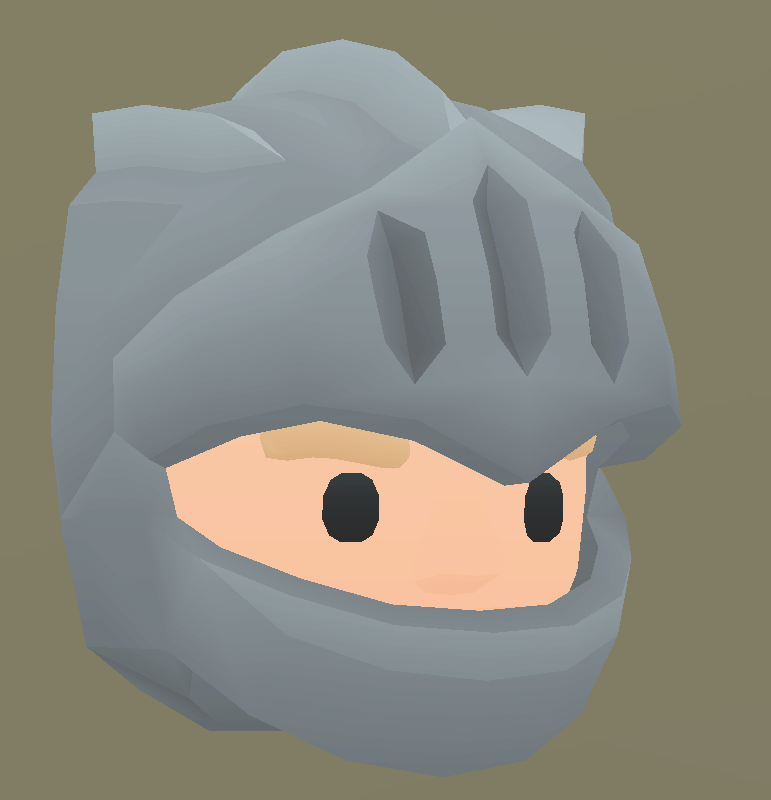
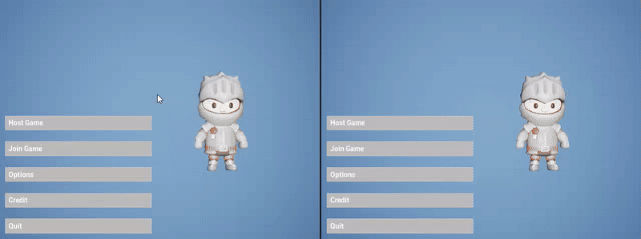
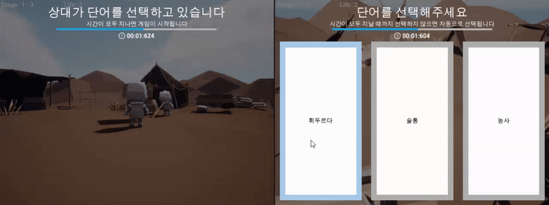

# 김윤성의 포트폴리오

<table>
  <tr>
    <td>
       목차   
      &nbsp;&nbsp;<a href="#about-me"> 1. About Me </a> 
      &nbsp;&nbsp;<a href="#team-project"> 2. 팀 프로젝트 </a> 
      &nbsp;&nbsp;&nbsp;&nbsp;&nbsp;&nbsp;<a href="#project-hal"> 2-1. Project_HAL </a> 
      &nbsp;&nbsp;&nbsp;&nbsp;&nbsp;&nbsp;<a href="#squire"> 2-2. Squire </a> 
      &nbsp;&nbsp;<a href="#contact"> 3. Contact </a> 
    </td>
  </tr>
</table>
 

# <a id="about-me"> [1. About Me](#index)
안녕하세요, 게임 클라이언트 프로그래머를 지망하고 있는 김윤성이라고 합니다.   

어릴 적부터 게임은 제 삶의 큰 즐거움이자 영감을 주는 원천이었습니다.   
게임이 선사하는 행복과 아름다움에 매료되어 자연스럽게 게임 개발이라는 길을 선택하게 되었습니다.   
아직 부족한 점도 많지만, 끊임없이 배우고 성장하며 더 많은 사람들에게 기쁨과 감동을 전할 수 있는 게임을 만들고 싶습니다.  
## 이름
&nbsp;&nbsp;&nbsp;&nbsp;김윤성
  
## 학력   
&nbsp;&nbsp;&nbsp;&nbsp;2019.03 ~ 2025.02   
&nbsp;&nbsp;&nbsp;&nbsp;서강대학교 컴퓨터공학과 졸업예정

## 희망 직무   
&nbsp;&nbsp;&nbsp;&nbsp;게임 클라이언트 프로그래머   
  
## 기술 스택 
### &nbsp;&nbsp;&nbsp;&nbsp;Unreal 5
&nbsp;&nbsp;&nbsp;&nbsp;&nbsp;&nbsp;&nbsp;&nbsp;&nbsp;&nbsp;Unreal 5의 프레임워크를 이용하여 3D 리슨 서버 기반의 멀티플레이 게임을 제작해 본 경험이 있습니다.
### &nbsp;&nbsp;&nbsp;&nbsp;Unity 5   
&nbsp;&nbsp;&nbsp;&nbsp;&nbsp;&nbsp;&nbsp;&nbsp;&nbsp;&nbsp;Unity 5의 프레임워크를 이용하여 2D 솔로플레이 게임을 제작해 본 경험이 있습니다.
### &nbsp;&nbsp;&nbsp;&nbsp;C/C++   
&nbsp;&nbsp;&nbsp;&nbsp;&nbsp;&nbsp;&nbsp;&nbsp;&nbsp;&nbsp;OpenGL API을 이용하여 3D Camera Viewing을 구현해본 경험이 있습니다.   
&nbsp;&nbsp;&nbsp;&nbsp;&nbsp;&nbsp;&nbsp;&nbsp;&nbsp;&nbsp;PintOS 프로젝트를 통해 User Stack과 Thread Scheduling을 구현해본 경험이 있습니다.

#  [2. 팀 프로젝트](#index)
##  [2-1. Project_HAL](#index)  

### 프로젝트 소개
- **개발 기간**   
  2024.03.09 ~ 2024.06.24
- **개발 환경**   
  Unity 2022.3.21f
- **설명**   
  Unity Game Engine을 이용하여 제작한 간단한 탑뷰 솔로플레이 2D 게임입니다.
- **프로젝트 목적**   
  Unity Game Engine을 이용하여 간단한 탑뷰 솔로플레이 2D 게임을 제작함으로써 Unity Engine의 프레임워크를 이해하고, 2D 게임 개발의 워크플로우와 필요 기술을 습득하는 것 목적으로 한다.
- **주요 기술 및 도구**   
  - Framework
    - Unity (C#)
  - Design Pattern
    - Entity-Component
    - SingleTone
- **멤버 구성**   
  프로그래밍 4명
- **기여 내용**   
  - PlayerEntity 설계 및 작성
  - EnemyEntity 설계 및 작성
  - VirtualCameraManager 설계 및 작성
  - UI 설계 및 작성
  - PickableObjects 설계 및 작성
### 주요 기능 및 이미지
  - 캐릭터 이동 제어 및 애니메이션 제어   
  
  
  - 오브젝트 와의 상호작용   
  
  
  - 인벤토리 구현 및 아이템 습득, 폐기 및 이동   
  

### More  
  - 이 프로젝트에 대해 더 자세한 내용과 구현 방법은 [여기](https://github.com/pwdab/Project_HAL)에서 보실 수 있습니다.   
  - 이 프로젝트에 대한 데모 영상은 아래의 유튜브 썸네일을 클릭해 보실 수 있습니다. 
    

##  [2-2. Squire](#index)     

### 프로젝트 소개
- **개발 기간**   
  2024.09.10 ~ 2024.12.06 (1차 빌드 완료)
- **개발 환경**   
  Unreal 5.2.1
- **설명**
  Unreal Game Engine을 이용하여 제작한 리슨(Listen) 서버 기반의 3D 멀티플레이 게임입니다.   
- **프로젝트 목적**   
  게임 제작에 필요한 컴퓨터 공학 관련 지식을 확인하고 이를 바탕으로 실제 플레이 가능한 게임을 제작한다. 특히 Unreal Engine 5의 프레임워크를 깊이 이해하고, 이를 활용하여 게임 플레이 구현에 필요한 다양한 도구들을 적용해보는 것을 목표로 한다. 제작된 게임은 패키징 및 배포 과정을 거쳐 실제 서비스로 제공하며, 유저들에게 피드백을 받아 게임을 개선하는 경험도 포함한다.
- **주요 기술 및 도구**   
  - **Framework**
    - Unreal (C++, Blueprint)
  - **Network**
    - Replication, RPC
  - **UI**
    - UMG
- **멤버 구성**:
  - 기획 및 레벨 디자인 1명
  - 프로그래밍 1명
- **기여 내용**:
  - 역할
    - 프로그래밍
  - 내용
    - 폰 및 액터의 제작
    - 네트워크 제어
    - UI 제작
    - 게임 플레이 구현
    - 
### **주요 기능 및 이미지**
  - 게임 Session 생성 및 참가   
    
    
  - 캐릭터 시선 처리   
    
    
  - 게임 흐름 제어와 데이터 동기화   
    

### More
  - 이 프로젝트에 대해 더 자세한 내용과 구현 방법은 [여기](https://github.com/pwdab/Squire)에서 보실 수 있습니다.   
  - 이 프로젝트의 데모 영상은 아래의 유튜브 썸네일을 클릭해 보실 수 있습니다. 
    
    
#  [3. Contact](#index)
## &nbsp;&nbsp;E-Mail
&nbsp;&nbsp;&nbsp;&nbsp;soundno07@naver.com   
## &nbsp;&nbsp;Git
&nbsp;&nbsp;&nbsp;&nbsp;[Git](https://github.com/pwdab)   
## &nbsp;&nbsp;Velog
&nbsp;&nbsp;&nbsp;&nbsp;[Velog](https://velog.io/@pwdab/)   
## &nbsp;&nbsp;YouTube
&nbsp;&nbsp;&nbsp;&nbsp;[YouTube](https://www.youtube.com/@%ED%8F%89%EB%8B%A4%EB%B2%94)
