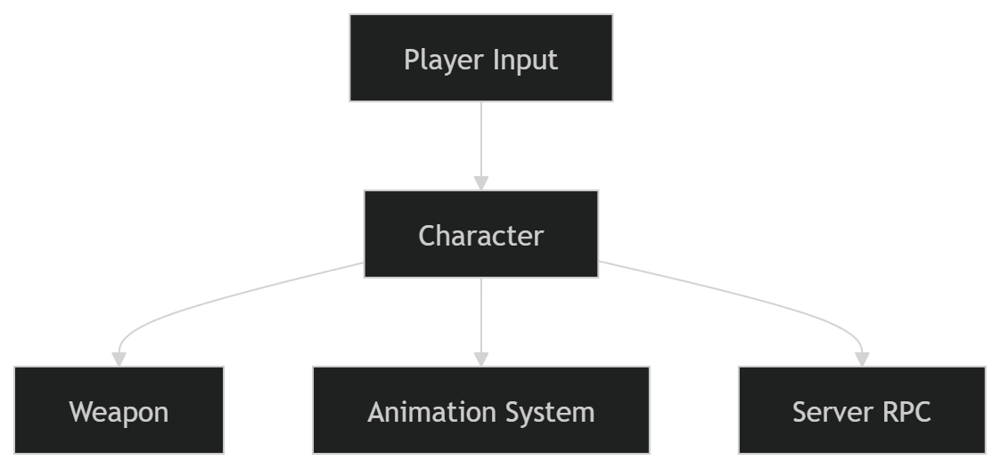
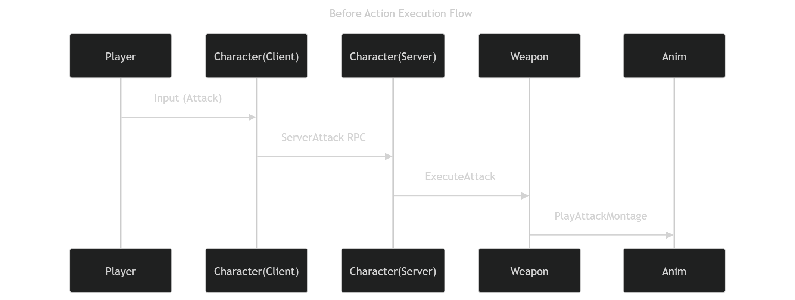
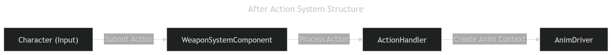
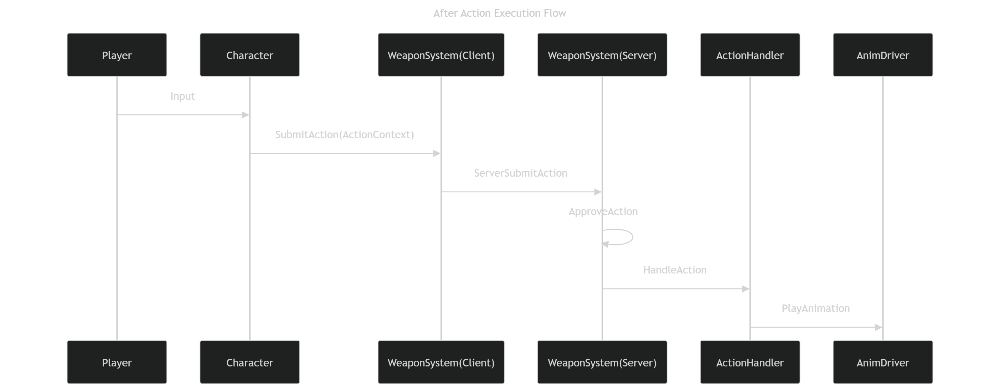
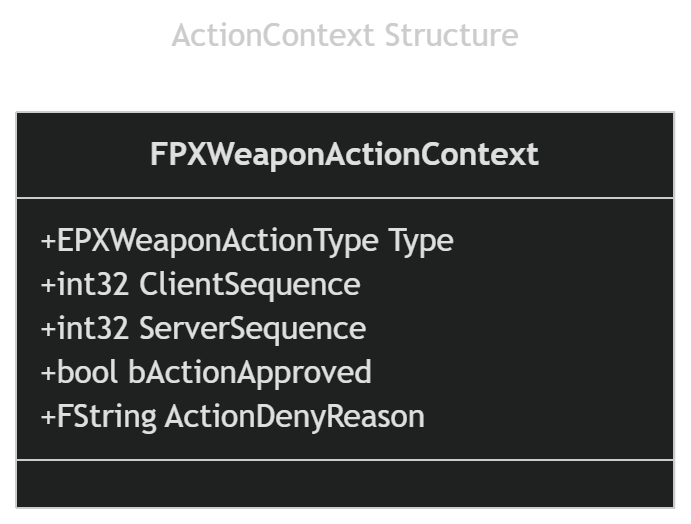
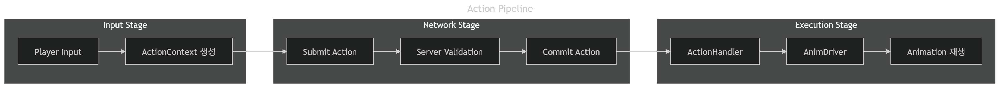

# Unreal Engine 5 Multiplayer Game Development Portfolio

<table>
  <tr>
    <td>
      
      &nbsp;&nbsp;<a href="#introduction"> 1. Introduction </a> 
      &nbsp;&nbsp;<a href="#project-summary"> 2. Project Summary </a> 
      &nbsp;&nbsp;<a href="#projects"> 3. Projects </a> 
      &nbsp;&nbsp;&nbsp;&nbsp;&nbsp;&nbsp;<a href="#action-system"> 3-1. Action 기반 멀티플레이 행동 처리 시스템 </a> 
<!--
	  &nbsp;&nbsp;&nbsp;&nbsp;&nbsp;&nbsp;&nbsp;&nbsp;&nbsp;&nbsp;<a href="#action-system-problem"> 문제 </a> 
	  &nbsp;&nbsp;&nbsp;&nbsp;&nbsp;&nbsp;&nbsp;&nbsp;&nbsp;&nbsp;<a href="#action-system-analysis"> 원인 </a> 
	  &nbsp;&nbsp;&nbsp;&nbsp;&nbsp;&nbsp;&nbsp;&nbsp;&nbsp;&nbsp;<a href="#action-system-solution"> 해결 </a> 
	  &nbsp;&nbsp;&nbsp;&nbsp;&nbsp;&nbsp;&nbsp;&nbsp;&nbsp;&nbsp;<a href="#action-system-result"> 결과 </a> 
-->
      &nbsp;&nbsp;&nbsp;&nbsp;&nbsp;&nbsp;<a href="#fastarray-inventory"> 3-2. Fast Array 기반 인벤토리 시스템 </a> 
<!--
	  &nbsp;&nbsp;&nbsp;&nbsp;&nbsp;&nbsp;&nbsp;&nbsp;&nbsp;&nbsp;<a href="#fastarray-inventory-problem"> 문제 </a> 
	  &nbsp;&nbsp;&nbsp;&nbsp;&nbsp;&nbsp;&nbsp;&nbsp;&nbsp;&nbsp;<a href="#fastarray-inventory-analysis"> 원인 </a> 
	  &nbsp;&nbsp;&nbsp;&nbsp;&nbsp;&nbsp;&nbsp;&nbsp;&nbsp;&nbsp;<a href="#fastarray-inventory-solution"> 해결 </a> 
	  &nbsp;&nbsp;&nbsp;&nbsp;&nbsp;&nbsp;&nbsp;&nbsp;&nbsp;&nbsp;<a href="#fastarray-inventory-result"> 결과 </a> \
-->
      &nbsp;&nbsp;&nbsp;&nbsp;&nbsp;&nbsp;<a href="#session-sync"> 3-3. 멀티플레이 세션 종료 동기화 </a> 
<!--
	  &nbsp;&nbsp;&nbsp;&nbsp;&nbsp;&nbsp;&nbsp;&nbsp;&nbsp;&nbsp;<a href="#session-sync-problem"> 문제 </a> 
	  &nbsp;&nbsp;&nbsp;&nbsp;&nbsp;&nbsp;&nbsp;&nbsp;&nbsp;&nbsp;<a href="#session-sync-analysis"> 원인 </a> 
	  &nbsp;&nbsp;&nbsp;&nbsp;&nbsp;&nbsp;&nbsp;&nbsp;&nbsp;&nbsp;<a href="#session-sync-solution"> 해결 </a> 
	  &nbsp;&nbsp;&nbsp;&nbsp;&nbsp;&nbsp;&nbsp;&nbsp;&nbsp;&nbsp;<a href="#session-sync-result"> 결과 </a> 
-->
    </td>
  </tr>
</table>

# [1. Introduction](#index)

### **이름**   
김윤성   

### **직무**   
게임 클라이언트 프로그래밍   

### **기술 스택**   
Unreal Engine 5 / C++ / Replication / RPC   

### 자기소개
Unreal Engine을 주로 다루며 코드 구조와 확장성을 중요하게 생각하는 게임 클라이언트 프로그래머입니다.   
Action 기반 처리 파이프라인과 FastArray 기반 인벤토리 시스템을 설계하며 유지보수와 확장을 고려한 게임 시스템을 개발했습니다.   
또한 Steam에 캐주얼 게임을 출시하며 게임 개발부터 서비스까지의 전반적인 과정을 경험했습니다.

 

#  [2. Project Summary](#index)

### [Action 기반 멀티플레이 행동 처리 시스템](#action-system)

- 캐릭터 행동 로직을 Action 기반 구조로 재설계하고 Sequence 기반 처리 방식을 도입하여 멀티플레이 환경에서 행동 처리 정합성을 확보했습니다.

### [Fast Array 기반 인벤토리 시스템](#fastarray-inventory)

- FastArray 기반 인벤토리 구조를 설계하여 변경된 슬롯만 동기화하도록 개선하고 네트워크 트래픽을 감소시켰습니다.

### [멀티플레이 세션 종료 동기화](#session-sync)

- 호스트 종료 시 클라이언트가 세션에 잔류하던 문제를 Client RPC 기반 동기화 구조로 해결하여 안정적인 세션 종료 흐름을 구현했습니다.

 

#  [3. Projects](#index)

## [3-1. Action 기반 멀티플레이 행동 처리 시스템](#index) 

### [문제](#index)

기존 행동 처리 시스템에서는 다음과 같은 문제가 발생했습니다.   

**1\. Character의 과도한 책임**   

**2\. 행동마다 서로 다른 처리 흐름**   

**3\. 멀티플레이 환경에서 행동 처리 순서 불일치**   

### [원인](#index)

문제의 원인은 기존 **행동 처리 구조**에 있었습니다.

	
	

**1\. Character 중심 구조**   
- 입력 이후의 행동 실행 로직을 <strong>`Character`</strong>가 직접 호출   
- 입력 처리, 상태 변경, 서버 RPC 호출, 공격 시작까지 <strong>`Character`</strong>가 담당   

**2\. 행동 처리의 표준화 부재**
- 행동을 공통 개념으로 관리하는 구조가 존재하지 않음
- 각 행동이 개별 함수와 RPC 흐름으로 구현되어 서로 다른 처리 경로를 가짐

**3\. RPC 기반 즉시 실행 구조**
- 입력 이벤트 발생 시 서버 RPC를 즉시 호출
- 네트워크 지연 환경에서 RPC 도착 순서가 달라질 경우 행동 순서가 보장되지 않음

### [해결](#index)

**1\. Character 책임 분리**

	
	

<strong>`Character`</strong> 중심 구조를 다음과 같이 역할 기반 구조로 분리했습니다.

- **`Character`**
  - 입력 처리
- **`WeaponSystemComponent`**
  - Action 제출
  - 서버 승인
  - 상태 업데이트
- **`ActionHandler`**
  - Action을 Animation Context로 변환
- **`AnimDriver`**
  - 애니메이션 재생

**2\. 행동 처리 구조 통합**

	
	

행동을 공통 데이터 구조인 <strong>`ActionContext`</strong>로 표현하고, 모든 행동이 동일한 처리 파이프라인을 거치도록 설계했습니다.

- 입력을 <strong>`ActionContext`</strong>로 변환하여 제출
- 행동 종류를 <strong>`ActionType`</strong>으로 구분
- 서버와 클라이언트에서 동일한 처리 구조 유지

**3\. Sequence 기반 순서 제어**

멀티플레이 환경에서 행동 처리 순서를 안정적으로 유지하기 위해 <strong>`Sequence ID`</strong>를 도입했습니다.

- <strong>`ClientSequence`</strong>
  - 클라이언트 입력 순서 관리
- <strong>`ServerSequence`</strong>
  - 서버 커밋 순서 관리

### [결과](#index)

Action 기반 구조를 도입한 결과 다음과 같은 효과를 얻을 수 있었습니다.

**1\. 구조 단순화**

- 모든 행동 처리를 **Action 파이프라인**으로 통합
- 행동 처리 흐름을 하나의 구조로 관리
  
**→** 코드 구조 단순화 및 **가독성, 유지보수성 개선**

**2\. 시스템 확장성 개선**

- 행동을 공통 Action 구조로 관리
- 새로운 행동 추가 시 최소한의 수정만 필요

**→** **기존 코드 수정 없이 행동 확장 가능**

**3\. 멀티플레이 정합성 확보**

- `Sequence ID` 기반 순서 제어 구조 도입
- 네트워크 지연 환경에서도 행동 순서 유지

**→** 멀티플레이 환경에서 발생하는 **Action 순서 불일치 문제 해결**

 

 

## [3-2. Fast Array 기반 인벤토리 시스템](#index) 

### [문제](#index)
멀티플레이 환경에서 인벤토리 데이터를 비효율적으로 동기화하고 있었습니다.

### [원인](#index)
인벤토리 전체 데이터를 전송하면서 불필요한 네트워크 트래픽이 발생했습니다.

### [해결](#index)
Fast Array Replication 기반 인벤토리 구조 설계
- FastArraySerializer 사용
- 변경된 슬롯만 동기화

### [결과](#index)
- 네트워크 트래픽 감소
- 인벤토리 동기화 효율 개선

 

 

## [3-3. 멀티플레이 세션 종료 동기화](#index) 

### [문제](#index)
호스트가 세션을 종료할 경우 클라이언트가 정상적으로 종료되지 않는 문제가 발생했습니다.

### [원인](#index)
세션 종료 흐름이 클라이언트에 전파되지 않는 구조였습니다.

### [해결](#index)
호스트가 종료 전에 Client RPC를 통해 종료 신호를 모든 클라이언트에 전파하도록 구조 개선

### [결과](#index)
모든 클라이언트가 정상적으로 세션을 종료하도록 개선

 

