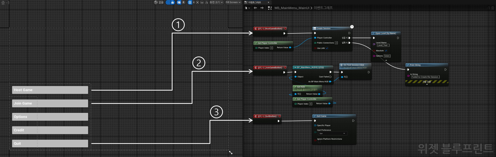
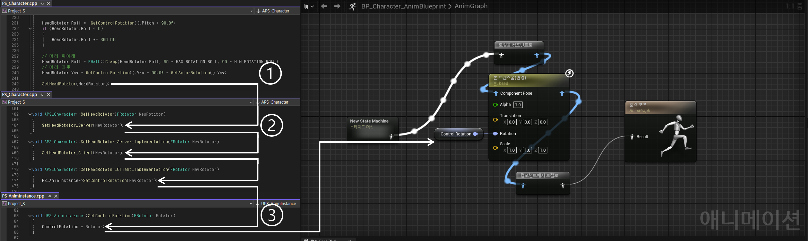
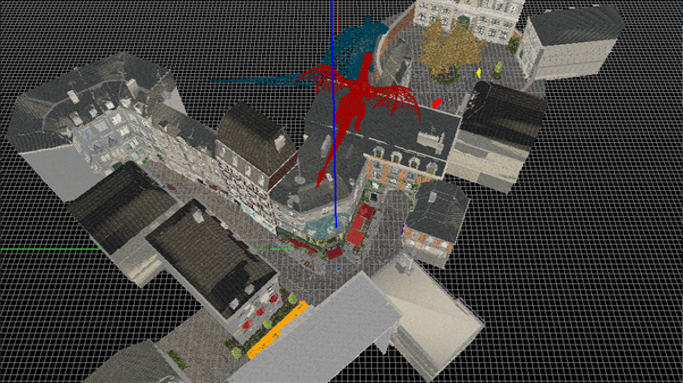
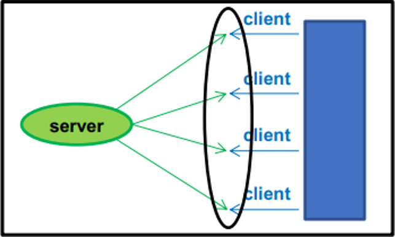

# 김윤성의 포트폴리오

<table>
  <tr>
    <td>
      <a id="index"></a> 목차 <br><br>
      &nbsp;&nbsp;<a href="#about-me"> 1. About Me </a><br>
      &nbsp;&nbsp;<a href="#team-project"> 2. 팀 프로젝트 </a><br>
      &nbsp;&nbsp;&nbsp;&nbsp;&nbsp;&nbsp;<a href="#project-hal"> 2-1. Project_HAL </a><br>
      &nbsp;&nbsp;&nbsp;&nbsp;&nbsp;&nbsp;<a href="#squire"> 2-2. Squire </a><br>
      &nbsp;&nbsp;<a href="#side-project"> 3. 개인 프로젝트 </a><br>
      &nbsp;&nbsp;&nbsp;&nbsp;&nbsp;&nbsp;<a href="#opengl-3d-viewing"> 3-1. OpenGL 3D Viewing </a><br>
      &nbsp;&nbsp;&nbsp;&nbsp;&nbsp;&nbsp;<a href="#concurrent-stock-server"> 3-2. Concurrent Stock Server </a><br>
      &nbsp;&nbsp;<a href="#contact"> 4. 연락처 </a><br>
    </td>
  </tr>
</table>
<br>

# <a id="about-me"> [1. About Me](#index)
안녕하세요, 게임 클라이언트 프로그래머를 지망하고 있는 김윤성이라고 합니다.   

어릴 적부터 게임은 제 삶의 큰 즐거움이자 영감을 주는 원천이었습니다.   
게임이 선사하는 행복과 아름다움에 매료되어 자연스럽게 게임 개발이라는 길을 선택하게 되었습니다.   
아직 부족한 점도 많지만, 끊임없이 배우고 성장하며 더 많은 사람들에게 기쁨과 감동을 전할 수 있는 게임을 만들고 싶습니다.  
## 이름
&nbsp;&nbsp;&nbsp;&nbsp;김윤성
  
## 학력   
&nbsp;&nbsp;&nbsp;&nbsp;2019.03 ~ 2025.02   
&nbsp;&nbsp;&nbsp;&nbsp;서강대학교 컴퓨터공학과 졸업예정

## 희망 직무   
&nbsp;&nbsp;&nbsp;&nbsp;게임 클라이언트 프로그래머   
  
## 기술 스택 
### &nbsp;&nbsp;&nbsp;&nbsp;Unreal 5
&nbsp;&nbsp;&nbsp;&nbsp;&nbsp;&nbsp;&nbsp;&nbsp;&nbsp;&nbsp;내용내용
### &nbsp;&nbsp;&nbsp;&nbsp;Unity 5   
&nbsp;&nbsp;&nbsp;&nbsp;&nbsp;&nbsp;&nbsp;&nbsp;&nbsp;&nbsp;내용내용
### &nbsp;&nbsp;&nbsp;&nbsp;C   
&nbsp;&nbsp;&nbsp;&nbsp;&nbsp;&nbsp;&nbsp;&nbsp;&nbsp;&nbsp;내용내용
### &nbsp;&nbsp;&nbsp;&nbsp;C++
&nbsp;&nbsp;&nbsp;&nbsp;&nbsp;&nbsp;&nbsp;&nbsp;&nbsp;&nbsp;내용내용

# <a id="team-project"></a> [2. 팀 프로젝트](#index)
## <a id="project-hal"></a> [2-1. Project_HAL](#index)  


- **설명**:   
  Unity Game Engine을 이용하여 제작한 간단한 탑뷰 솔로플레이 2D 게임입니다.
- **개발 환경 및 언어**:   
  Unity 2022.3.21f, C#   
- **기여 내용**:   
  - PlayerEntity, EnemyEntity, VirtualCameraManager, UI, PickableObjects 설계 및 작성   
- **주요 기능 및 구현 방법**:   
  1. 캐릭터 애니메이션 재생 및 캔슬   
  <br>
      - AnimationController와 Coroutine을 이용해 애니메이션의 재생을 제어
        
        ``` C#
        public IEnumerator Attack(Animator animator)
        {
            if (!is_animation_playing)
            {
                CharacterStop();
        
                // 이전에 재생되던 애니메이션이 존재 (캔슬한 경우)
                if (is_animation_cancelable)
                {
                    while (!animator.GetCurrentAnimatorStateInfo(0).IsName("0_idle"))
                    {
                        animator.SetInteger(animationState, (int)AnimationStateEnum.idle);
                        yield return null;
                    }
                    is_animation_cancelable = false;
                }
        
                while (!animator.GetCurrentAnimatorStateInfo(0).IsName("2_Attack_Bow"))
                {
                    animator.SetInteger(animationState, (int)AnimationStateEnum.attack);
                    yield return null;
                }
        
                while (animator.GetCurrentAnimatorStateInfo(0).normalizedTime < 1.0f)
                {
                    is_animation_playing = true;
                    if (animator.GetCurrentAnimatorStateInfo(0).normalizedTime > 0.5f)
                    {
                        is_animation_cancelable = true;
                        is_moveable = true;
                    }
                    yield return null;
                }
        
                if (is_animation_playing)
                {
                    CharacterIdleSet();
                }
            }
            is_animation_started = false;
            animation_coroutine = null;
        }
        ```
  
  2. 상호작용   
  <br>
      - Entity에 부착되어 있는 Collider2D 컴포넌트를 활용해 상호작용 구현
        <p align="center">
          
          
          
          
        </p>
        
        ``` C#
        // 상호작용 시작
        private void OnTriggerEnter2D(Collider2D collision)
        {
            if (is_alive && collision.gameObject.CompareTag(pickable_objects))
            {
                PickableObjects hitObject = collision.gameObject.GetComponent<PickableObjects>();
        
                if (hitObject != null)
                {
                    bool should_disappear = false;
        
                    switch (hitObject.Item.ItemType)
                    {
                        case Item.ItemTypeEnum.GRASS:
                        case Item.ItemTypeEnum.STONE:
                        case Item.ItemTypeEnum.COIN:
                            should_disappear = inventory_ui.AddItem(hitObject);
                            break;
                        case Item.ItemTypeEnum.HEALTH:
                            should_disappear = stat_manager.AdjustHP(hitObject.Quantity);
                            break;
                    }
        
                    if (should_disappear)
                    {
                        Destroy(collision.gameObject, .0f);
                    }
                }
            }
        }
        ```
        ``` C#
        // 상호작용 끝
        void OnCollisionEnter2D(UnityEngine.Collision2D collision)
        {
            if (collision.gameObject.CompareTag("Player"))
            {
                PlayerEntity player = collision.gameObject.GetComponent<PlayerEntity>();
        
                if (player.player_damage_coroutine == null)
                {
                    // interval의 딜레이마다 damage_scale의 피해를 입힌다
                    player.player_damage_coroutine = StartCoroutine(player.DamageEntity(damage_scale, 1.0f, this.gameObject));
                }
            }
        }
        ```  
  3. 아이템 습득, 폐기 및 이동   
  <br>   
      - 배열과 prefab을 통한 인벤토리와 기능 구현   
        ``` C#
        public bool AddItem(PickableObjects itemToAdd)
        {
            // 추가하려는 아이템이 인벤토리에 존재
            for (int i = 0; i < items.Length; i++)
            {
                if (items[i] != null && items[i].ItemType == itemToAdd.Item.ItemType && itemToAdd.Item.Stackable == true)
                {
                    InventorySlotUI slotScript = slots[i].GetComponent<InventorySlotUI>();
                    TMP_Text qtyText = slotScript.transform.GetComponentsInChildren<TMP_Text>()[0];
        
                    if (qtyText != null)
                    {
                        int qty = int.Parse(qtyText.text);
                        qty += itemToAdd.Quantity;
                        qtyText.text = qty.ToString();
                    }
        
                    return true;
                }
            }
            // 추가하려는 아이템이 인벤토리에 존재하지 않음
            for (int i = 0; i < items.Length; i++)
            {
                if (items[i] == null)
                {
                    items[i] = Instantiate(itemToAdd.Item);
                    itemImages[i].sprite = itemToAdd.Item.Sprite;
                    itemImages[i].enabled = true;
                    InventorySlotUI slotScript = slots[i].GetComponent<InventorySlotUI>();
                    TMP_Text qtyText = slotScript.transform.GetComponentsInChildren<TMP_Text>()[0];
        
                    if (qtyText != null)
                    {
                        qtyText.enabled = true;
                        int qty = itemToAdd.Quantity;
                        qtyText.text = qty.ToString();
                    }
        
                    return true;
                }
            }
            // 아이템 추가 실패
            return false;
        }
        ```
        
- **More**:   
  - 이 프로젝트에 대해 더 자세한 내용은 [여기](https://github.com/pwdab/Portfolio/tree/main/Project%20HAL)에서 보실 수 있습니다.   
  - 이 프로젝트에 대한 데모 영상은 아래의 유튜브 썸네일을 클릭해 보실 수 있습니다. 
    [](https://www.youtube.com/watch?v=RwQ4D90kwPk)

## <a id="squire"></a> [2-2. Squire](#index)     


- **설명**:   
  Unreal Game Engine을 이용하여 제작한 리슨(Listen) 서버 기반의 3D 멀티플레이 게임입니다.   
- **개발 환경 및 언어**:   
  Unreal 5.2.1, C++, Blueprint   
- **기여 내용**:   
  - 내용: 폰 및 액터의 제작, 네트워크 제어, UI 제작, 게임 플레이 구현   
- **주요 기능 및 구현 방법**:   
  1. 게임 Session 생성 및 참가   
  <br>
      - UMG와 블루프린트를 이용한 MainMenu UI와 Session UI 제작 
           
        ① Host Game 버튼을 누르면 PlayerController는 LAN 상에서 Listen Server로 서버를 열고, 로비 맵으로 이동한다.   
        ② Join Game 버튼을 누르면 Find_Session_UI를 화면에 출력한다.   
        ③ Quit 버튼을 누르면 게임을 종료한다.   
    
  2. 캐릭터 시선 처리   
  <br>
      - RPC를 활용해 캐릭터의 Rotator 변수를 동기화
        
        ```C++
        // PS_Character.cpp

        void APS_Character::Tick(float DeltaTime)
        {
            Super::Tick(DeltaTime);
            ⋮
            HeadRotator.Roll = -GetControlRotation().Pitch + 90.0f;
            if (HeadRotator.Roll < 0)
            {
            	HeadRotator.Roll += 360.0f;
            }
            
            // 머리 위아래
            HeadRotator.Roll = FMath::Clamp(HeadRotator.Roll, 90 - MAX_ROTATION_ROLL, 90 - MIN_ROTATION_ROLL);
            // 머리 좌우
            HeadRotator.Yaw = GetControlRotation().Yaw - 90.0f - GetActorRotation().Yaw;
            
            SetHeadRotator(HeadRotator);
            ⋮
        }
        
        void APS_Character::SetHeadRotator(FRotator NewRotator)
        {
        	  SetHeadRotator_Server(NewRotator);
        }
        
        void APS_Character::SetHeadRotator_Server_Implementation(FRotator NewRotator)
        {
        	  SetHeadRotator_Client(NewRotator);
        }
        
        void APS_Character::SetHeadRotator_Client_Implementation(FRotator NewRotator)
        {
        	  PS_AnimInstance->SetControlRotation(NewRotator);
        }
        ```
        ```C++
        // PS_AnimInstance.cpp
        
        void UPS_AnimInstance::SetControlRotation(FRotator Rotator)
        {
        	  ControlRotation = Rotator;
        }
        ```
  3. 게임 흐름 제어와 데이터 동기화   
  <br>
      - GameMode를 통한 게임 흐름 제어와 변수 Replication을 통한 데이터 동기화
        ```C++
        // PS_GameMode.cpp
        void APS_GameMode::StartFirstWordSelectionTimer(int TimeLimit)
        {
            PS_LOG_S(Log);
        
            ButtonWords = InitializeWords(CurrentMap, CurrentStage, 3);
        
            // 모든 Player에 Stage UI 추가
            for (FConstPlayerControllerIterator It = GetWorld()->GetPlayerControllerIterator(); It; It++)
            {
                APS_PlayerController* PS_PlayerController = Cast<APS_PlayerController>(It->Get());
                if (PS_PlayerController)
                {
                    PS_PlayerController->ShowStageUI();
                }
            }
        
            // 타이머 설정
            GetWorldTimerManager().SetTimer(SelectionUITimerHandle, this, &APS_GameMode::OnFirstWordSelectionComplete, TimeLimit, false);
        
            // 첫번째 PlayerController에 단어 선택 UI 추가
            FConstPlayerControllerIterator It = GetWorld()->GetPlayerControllerIterator();
            APS_PlayerController* PS_PlayerController = Cast<APS_PlayerController>(It->Get());
            if (PS_PlayerController)
            {
                APS_PlayerState* PS_PlayerState = Cast<APS_PlayerState>(PS_PlayerController->PlayerState);
                if (PS_PlayerState)
                {
                    PS_PlayerState->InitSelectedWord();
                }
                PS_PlayerController->ShowWordSelectionUI(GetWorld()->GetTimerManager().GetTimerRemaining(SelectionUITimerHandle));
                PS_PlayerController->SetSelectionButtonWords(ButtonWords);
            }
        
            // 두번째 PlayerController에 대기 UI 추가
            It++;
            PS_PlayerController = Cast<APS_PlayerController>(It->Get());
            if (PS_PlayerController)
            {
                PS_PlayerController->ShowStageTextUI(FString(TEXT("")));
                PS_PlayerController->ShowWordSelectionWaitUI(GetWorld()->GetTimerManager().GetTimerRemaining(SelectionUITimerHandle));
            }
        }
        ```
        ```C++
        // PS_PlayerController.h
        UCLASS()
        class PROJECT_S_API APS_PlayerController : public APlayerController
        {
        	GENERATED_BODY()
        
          public:
              ⋮
              UFUNCTION(Client, Reliable)
              void ShowStageUI();
      
              UFUNCTION(Client, Reliable)
              void ShowWordSelectionUI(float RemainingTime);

              UFUNCTION(Client, Reliable)
              void SetSelectionButtonWords(const TArray<FString>& SelectedWords);
              
              UFUNCTION(Client, Reliable)
              void ShowStageTextUI(const FString& Text);
              
              UFUNCTION(Client, Reliable)
              void ShowAnswerSelectionWaitUI(float RemainingTime);
              ⋮
        }
        ```
  

- **More**:   
  - 이 프로젝트에 대해 더 자세한 내용은 [여기](https://github.com/pwdab/Portfolio/tree/main/Squire)에서 보실 수 있습니다.   
  - 이 프로젝트에 대한 데모 영상은 아래의 유튜브 썸네일을 클릭해 보실 수 있습니다. 
    [](https://www.youtube.com/watch?v=AIy8zwr5r8M)

# <a id="side-project"></a> [3. 개인 프로젝트](#index)  
## <a id="opengl-3d-viewing"></a>[3-1. OpenGL 3D Viewing](#index)  


- **설명**:   
  OpenGL을 이용해 3D 맵에서의 오브젝트 및 가상 카메라를 배치하고 움직임을 구현했습니다.
- **개발 환경 및 언어**:   
  OpenGL 4.6, C++
- **주요 기능 및 이미지**:
  - 물체의 배치 및 움직임   
  <p align="center">
    
    
  </p>

  - 가상 카메라의 배치 및 조절
  <p align="center">
    
    
  </p>
  <p align="center">
    
    
  </p>
  
- **More**:   
  - 이 프로젝트에 대해 더 자세한 내용은 [여기](https://github.com/pwdab/Portfolio/tree/main/OpenGL%203D%20Viewing)에서 보실 수 있습니다.   
  - 이 프로젝트에 대한 데모 영상은 아래의 유튜브 썸네일을 클릭해 보실 수 있습니다. 
    [](https://www.youtube.com/watch?v=TaTx-juZHFY)

## <a id="concurrent-stock-server"></a> [3-2. Concurrent Stock Server](#index)  


- **설명**:   
  C를 이용해 다중 Client의 요청을 처리하기 위한 Stock Server입니다.
- **개발 환경 및 언어**:   
  Linux 4.4.0, C
- **주요 기능 및 이미지**:
  - 서버 접속 및 주식 정보 조회, 구매, 판매   
  

- **More**:
  - 이 프로젝트에 대해 더 자세한 내용은 [여기](https://github.com/pwdab/Portfolio/tree/main/Concurrent%20Stock%20Server)에서 보실 수 있습니다.   
# <a id="contact"></a> [4. Contact](#index)
## &nbsp;&nbsp;E-Mail
&nbsp;&nbsp;&nbsp;&nbsp;soundno07@naver.com   
## &nbsp;&nbsp;Git
&nbsp;&nbsp;&nbsp;&nbsp;[Git](https://github.com/pwdab)   
## &nbsp;&nbsp;YouTube
&nbsp;&nbsp;&nbsp;&nbsp;[YouTube](https://www.youtube.com/@%ED%8F%89%EB%8B%A4%EB%B2%94)
