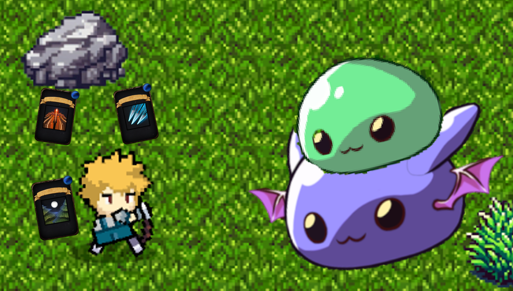
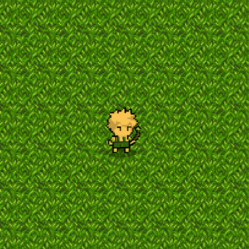
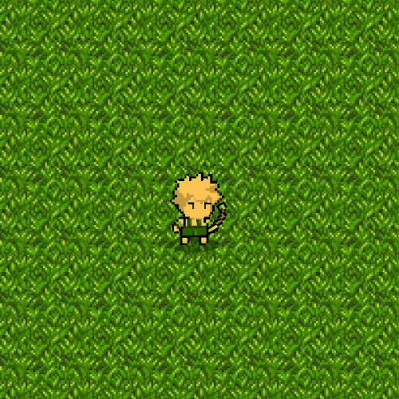

# 김윤성의 포트폴리오

<table>
  <tr>
    <td>
      <b><a id="index"></a> 목차</b><br>
      &nbsp;&nbsp;<a href="#introduction"> 1. Introduction </a><br>
      &nbsp;&nbsp;<a href="#technical-stacks"> 2. Technical Stacks </a><br>
      &nbsp;&nbsp;<a href="#team-projects"> 3. Team Projects </a><br>
      &nbsp;&nbsp;&nbsp;&nbsp;&nbsp;&nbsp;<a href="#Project_HAL"> 3-1. Project_HAL </a><br>
      &nbsp;&nbsp;&nbsp;&nbsp;&nbsp;&nbsp;<a href="#The First Foreigner"> 3-2. The First Foreignere </a><br>
      &nbsp;&nbsp;<a href="#contact"> 3. Contact </a><br>
    </td>
  </tr>
</table>

<br>

<!--
<details open>
	<summary>
		<h1>
		  <a id="introduction"><a href="#index">1. 👋 Introduction </a>
		</h1>
	</summary>
	-->  
 
# <a id="introduction"> [1. 👋 Introduction](#index)

안녕하세요, 게임 클라이언트 프로그래머를 지망하고 있는 김윤성이라고 합니다.   

어릴 적부터 게임은 제 삶의 큰 즐거움이자 영감을 주는 원천이었습니다.   
게임이 선사하는 행복과 아름다움에 매료되어 자연스럽게 게임 개발이라는 길을 선택하게 되었습니다.   
아직 부족한 점도 많지만, 끊임없이 배우고 성장하며 더 많은 사람들에게 기쁨과 감동을 전할 수 있는 게임을 만들고 싶습니다.  
## 🏷️ 이름
김윤성 (Kim Youn Sung)   

## 💼 직무
C++ 게임 클라이언트 프로그래밍
  
## 🎓 학력   
2019.02 ~ 2026.02   
서강대학교 컴퓨터공학과 졸업예정   

2014.02 ~ 2017.02   
영동일고등학교 졸업   

## 🏃 활동   
2025.02.07 ~ 2025.02.10   
메이플 대학생 게임 커리어 캠프, 메토링 2기 수료

<br>

<!--
<details open>
  <summary>
	  <h1>
		  <a id="technical-stacks"><a href="#index">2. 💻 Technical Stacks </a>
	  </h1>
  </summary>
  -->
  
# <a id="technical-stacks"> [2. 💻 Technical Stacks](#index)
###  Unreal Engine 5

- Listen Server 기반 3D 멀티플레이 게임 개발 및 출시
- Unreal Gameplay Framework 이해 및 C++ API 활용
- Replication·RPC를 활용한 네트워크 동기화 및 클라이언트·서버 상호작용 구현   
- Animation Blueprint·State Machine·Montage를 활용한 애니메이션 제어
- Actor Component·Delegate·Notify를 활용한 모듈형·이벤트 중심 시스템 설계
- UMG를 활용한 동적 UI 제작 및 데이터 연동
- Steamworks API·OnlineSubsystem를 활용한 세션 생성 및 관리
###  Unity 
- 2D 싱글플레이 게임 개발 경험
- Unity Entity-Component 구조 이해
- Sprite·Animator Controller를 활용한 애니메이션 전환 구현
- Collider2D를 활용한 캐릭터·오브젝트 상호작용 처리
- Canvas·UI를 활용한 동적 UI 및 인벤토리 시스템 구현
###  C/C++   
- OpenGL API를 활용한 3D Camera Viewing System 구현
- PintOS 환경에서 User Stack 구조 및 Thread Scheduling 구현
- Linux 환경에서 프로세스 간 통신 기반 주식 거래 시뮬레이터 개발 및 동시성 문제 해결

<br>
</details>

<details open>
	<summary>
		<h1>
			<a id="team-projects"><a href="#index">3. 👥 Team Projects </a>
			<!---->
		</h1>
	</summary>
<!--# <a id="team-projects"></a> [3. 👥 Team Projects](#index) -->

<!--
<details open>
	<summary>
		<h1>
			<a id="project-hal"></a>
			<a href="#index">3-1. Project_HAL</a>
		</h1>
	</summary>		  
 -->

# <a id="Project_HAL"></a> [3-1. Project_HAL](#index) 

<div align="center">
  
</div>

<p align="center">
	
	
	
</p>

<details>
	<summary> <strong><em>내용 펼치기/접기</em></strong>
	</summary>

<br>

## 📌 프로젝트 소개
- **개발 기간**   
  2024.03.09 ~ 2024.06.24
  
- **개발 상태**   
  데모 빌드 배포 완료 (개발 종료)
  
- **개발 환경**   
  Unity 2022.3.21f   
  Windows 10 (64bit)
  
- **프로젝트 개요**   
  탑뷰 2D 싱글플레이 어드벤처 게임   
  플레이어는 기본 공격과 카드 드로우 기반 스킬로 몬스터를 처치하고 스테이지를 클리어
  
- **프로젝트 목적**   
  Unity 프레임워크 학습 및 2D 게임 개발 워크플로우 이해
  
- **멤버 구성**   
  프로그래밍 4명

<br>

## 🎯 담당 업무
- Sprite Atlas 기반 2D 애니메이션 제작 및 Animator Controller 상태 전환 구현   
- Canvas·UI 컴포넌트를 활용한 동적 UI 구현 및 동기화   
- Collider2D 기반 캐릭터-오브젝트 상호작용 처리   
- 아이템 획득·폐기·이동이 가능한 인벤토리 시스템 구현   

<br>

## 🛠 문제 해결 과정   
<details>
			<summary> <h3>캐릭터 애니메이션 전환 로직 개선</h3>
			</summary>
	
<!--### 1. 캐릭터 애니메이션 전환 로직 개선   -->
- **문제**   
  간헐적으로 캐릭터의 애니메이션(ex. 공격)이 재생되지 않는 현상 발생   
  <div align="center">
       
  </div>
  
- **원인**   
  루프로 설정된 Idle 애니메이션의 진행도(normalizedTime) 값이 1.0f를 넘어 누적   
  Animator의 상태가 실제로 전환되기도 전에 애니메이션 종료 조건이 먼저 충족되어 다음 루틴이 실행되지 않음
	<p>
	<details>
		<summary> <em>코드 접기/펼치기</em>
		</summary>
	
	```C#
	// Before
	public IEnumerator Attack(Animator animator)
	{
	  ︙
		// 캐릭터의 상태를 "Attack"으로 바꿈
		if (!animator.GetCurrentAnimatorStateInfo(0).IsName("2_Attack_Bow"))
		{
			animator.SetInteger(animationState, (int)AnimationStateEnum.attack);
		}
	
		// state가 아직 "Attack"으로 바뀌지 않았음에도 이전에 재생 중이던 Idle의 normalizedTime이 1.0f을 넘으면 아래의 코드가 작동하지 않음
		while (animator.GetCurrentAnimatorStateInfo(0).normalizedTime < 1.0f)
		{
			// 현재 애니메이션이 종료될 때까지 기다림
		}
	  ︙
	}
	```
 	<br>
	</details>
	</p>


- **해결**   
  Animator의 상태가 확실히 바뀌도록 대기하는 로직을 추가
	<p>
	<details>
		<summary> <em>코드 접기/펼치기</em>
		</summary>
	
	```C#
	// After
	public IEnumerator Attack(Animator animator)
	{
	  ︙
	    // 캐릭터의 상태를 확실히 "Attack"으로 바꿀 때까지 기다림
	    while (!animator.GetCurrentAnimatorStateInfo(0).IsName("2_Attack_Bow"))
	    {
	        animator.SetInteger(animationState, (int)AnimationStateEnum.attack);
	        yield return null;
	    }
	
	    // state가 확실히 "Attack"으로 바뀌었으므로 normalizedTime은 0.0f부터 시작
	    // 따라서 아래의 코드가 정상적으로 작동함
	    while (animator.GetCurrentAnimatorStateInfo(0).normalizedTime < 1.0f)
	    {
	        // 현재 애니메이션이 종료될 때까지 기다림
	    }
	  ︙
	}
	```
	<br>
	</details>
	</p>

- **결과**   
  애니메이션이 정상적으로 재생되지 않던 문제 해결   
  애니메이션 상태 전환에서 안정성을 확보함으로써 추후 애니메이션의 후딜레이를 캔슬하는 기능으로 확장해 조작감과 전투 흐름을 개선   
  <div align="center">
       
  </div>
</details>

## 🎮 데모 플레이   
- **플레이 방법**   
  -  [구글 드라이브](https://drive.google.com/file/d/1hhAQobi0zfsc5SucmJjASzMnFuvB9EYg/view?usp=sharing)에서 Project_HAL_Demo.zip 파일을 다운로드 후 압축 해제   
  - HALNENG.exe 파일 실행   
- **플레이 영상**   
  - 아래 썸네일을 클릭하면  YouTube로 이동합니다.
    <div align="center">
      <a href="https://youtu.be/5klQiKKPS54">
        
      </a>
    </div>

## 📖 참고 자료
Halpern, J. (2016). *Learn Unity 2D Game Development with C#*. 김홍중 옮김. 서울: 에이콘. (2020).   
Unity Official Documentation (Unity Manual & Scripting API)  

<br>

## 🔗 추가 정보
상세 내용 및 구현 코드는  [GitHub Repository](https://github.com/pwdab/Project_HAL)에서 확인 가능합니다.

</details>
</details>

<br>
<!--
<details>
	<summary>
		<h1>
  			<a id="The First Foreigner"></a>
	 		<a href="#index">3-2. The First Foreigner</a>
		</h1>
	</summary>
-->

# <a id="The First Foreigner"></a> [3-2. The First Foreigner](#index)

<div align="center">
  
</div> 

<details>
	<summary> <strong><em>내용 펼치기/접기</em></strong>
	</summary>
	  
<br>

## 📌 프로젝트 소개
- **개발 기간**   
  2024.09.10 ~ 2024.12.06 : 리슨 서버 기반 빌드 개발 완료   
  2025.05.17 ~ 2025.06.09 : EOS(Epic OnlineSubsystem) 기반 리팩토링 및 Steam 업로드 완료
  
- **개발 상태**   
  Steam 게시 완료 (개발 종료)
  
- **개발 환경**   
  Unreal 5.2.1   
  Windows 10 (64bit)
  
- **프로젝트 개요**   
  3D 멀티플레이 캐주얼 게임   
  두 명의 플레이어가 번갈아 제시어를 행동이나 사물로 표현하고, 상대가 이를 추리해 맞추는 방식
  
- **프로젝트 목적**   
  Unreal Engine 5 프레임워크 학습 및 클라이언트-서버 기반 네트워크 게임 개발   
  패키징·배포 및 유저 피드백을 통한 개선 경험
  
- **멤버 구성**
	기획 및 레벨 디자인 1명   
	프로그래밍 1명

<br>

## 🎯 담당 업무
- Unreal Gameplay Framework 기반 게임 플레이 로직 구현   
- Replication·RPC 기반 클라이언트–서버 데이터 동기화 및 명령 처리   
- Animation Blueprint·AnimInstance·State Machine 기반 캐릭터 애니메이션 제어   
- Widget Blueprint 기반 동적 UI 제작 및 데이터 연동
- Steamworks API·OnlineSubsystem 기반 Steam 연동 및 세션 관리

<br>

## 🛠 문제 해결 과정   
<details>
			<summary> <h3>캐릭터의 시선 Rotator 처리</h3>
			</summary>
<!--### 1. 캐릭터의 시선 Rotator 처리   -->
	
- **문제**   
  호스트 캐릭터는 시선 Rotator에 따라 정상적으로 회전   
  하지만 로컬 캐릭터는 시선 Rotator가 적용되지 않고 초기값으로 되돌아가는 현상이 발생   
  <div align="center">
       
  </div>
  
- **원인**   
  AnimInstance::NativeUpdateAnimation()에서 캐릭터 시선의 Rotator를 직접 계산하고 Bone을 회전한 것이 문제   
  AnimInstance 멤버 변수는 동기화 되지 않으므로 로컬에서 변경된 시선 Rotator가 다른 로컬에 전파되지 않음
	<p>
		<details>
			<summary> <em>코드 접기/펼치기</em>
			</summary>
		
	```C++
	// Before
	void UPS_AnimInstance::NativeUpdateAnimation(float DeltaSeconds)
	{
	  ︙
		// AnimInstance에서 ControlRotation을 직접 계산
		ControlRotation.Roll = -Character->GetControlRotation().Pitch + 90.0f;
		if (ControlRotation.Roll < 0)
		{
		  ControlRotation.Roll += 360.0f;
		}
		ControlRotation.Roll = FMath::Clamp(ControlRotation.Roll, 90 - MAX_ROTATION_ROLL, 90 - MIN_ROTATION_ROLL);
		ControlRotation.Yaw = Character->GetControlRotation().Yaw - 90.0f - Character->GetActorRotation().Yaw;
	  ︙
	}
	```
	</details>
	</p>

- **해결**   
  로컬 캐릭터의 시선 Rotator가 변경되면 RPC를 통해 서버에 전달하고, 서버가 NetMulticast로 모든 클라이언트에 전파하도록 구조를 변경   
	<p>
		<details>
			<summary> <em>코드 접기/펼치기</em>
			</summary>

	```C#
	// After
	void APS_Character::SetHeadRotator(FRotator NewRotator)
	{
	  // 로컬에서 서버로 RPC 요청
		SetHeadRotator_Server(NewRotator);
	}
	
	UFUNCTION(Server, Reliable)
	void SetHeadRotator_Server(FRotator NewRotator);
	
	void APS_Character::SetHeadRotator_Server_Implementation(FRotator NewRotator)
	{
	  // 서버에서 모든 클라이언트로 전파
		SetHeadRotator_Client(NewRotator);
	}
	
	UFUNCTION(NetMulticast, Reliable)
	void SetHeadRotator_Client(FRotator NewRotator);
	
	void APS_Character::SetHeadRotator_Client_Implementation(FRotator NewRotator)
	{
		PS_AnimInstance->SetControlRotation(NewRotator);
	}
	```
	</details>
	</p>

- **결과**   
  캐릭터의 시선 Rotator가 호스트와 모든 로컬 클라이언트에서 동일하게 동기화되어 자연스러운 시선 처리를 연출   
  <div align="center">
    
  </div>
</details>

<details>
			<summary> <h3>리팩토링</h3>
			</summary>
<!--### 2. 리팩토링   -->
	
- **문제**   
  Listen Server 기반으로 개발되어 같은 네트워크 상에 있지 않으면 같이 플레이가 불가능   
- **원인**   
```C++
```
- **해결**   
  Epic Games의 OnlineSubsystem과 Steam API를 이용해 
```C++
```
- **결과**   
   [Steam](https://store.steampowered.com/app/3634090/The_First_Foreigner/)에 성공적으로 게시   
  <div align="center">
      
  </div>
</details>

<details>
			<summary> <h3>호스트 종료 시 클라이언트 세션이 초기화되지 않는 버그</h3>
			</summary>
<!--### 3. 호스트 종료 시 클라이언트 세션이 초기화되지 않는 버그   -->
	
- **문제**   
  호스트가 세션을 종료하면, 클라이언트의 세션이 정상적으로 종료되지 않아 존재하지 않는 세션에 접근하는 문제 발생   
  이로 인해 클라이언트는 Find Session 목록을 갱신하지 못하고, 강제로 Host Game을 실행해야만 정상적으로 출력됨   
  <div align="center">
       
  </div>
  
- **원인**   
  호스트가 클라이언트보다 먼저 세션을 종료해 클라이언트에서는 이미 없는 세션을 참조하는 상태가 됨
	<p>
		<details>
			<summary> <em>코드 접기/펼치기</em>
			</summary>
	
	```C++
	// Before
	void UPS_GameInstance::OnEndSessionComplete(FName SessionName, bool bWasSuccessful)
	{
	  ︙
	    // 클라이언트 세션 종료 없이 호스트가 먼저 세션을 종료
	    OnDestroySessionCompleteDelegateHandle = SessionInterface->AddOnDestroySessionCompleteDelegate_Handle(OnDestroySessionCompleteDelegate);
	    SessionInterface->DestroySession(CurrentSessionName);
	  ︙
	}
	```
	</details>
	</p>
 
- **해결**   
  호스트가 세션을 종료하기 전에 모든 클라이언트를 순회하며 RPC를 통해 세션 종료를 요청하도록 변경   
  각 클라이언트는 GameInstance::LeaveSession()을 호출해 스스로 세션을 종료   
	<p>
		<details>
			<summary> <em>코드 접기/펼치기</em>
			</summary>
	
	```C++
	// After
	void UPS_GameInstance::OnEndSessionComplete(FName SessionName, bool bWasSuccessful)
	{
	  ︙
	    // 호스트 종료 전 모든 클라이언트에게 세션 종료 요청
	    for (FConstPlayerControllerIterator It = World->GetPlayerControllerIterator(); It; ++It)
	    {
	        APS_PlayerController* PC = Cast<APS_PlayerController>(It->Get());
	        if (PC && !PC->IsLocalController())
	        {
	            PC->Client_OnHostEndSession();
	        }
	    }
	  ︙
	}
	
	UFUNCTION(Client, Reliable)
	void Client_OnHostEndSession();
	
	void APS_PlayerController::Client_OnHostEndSession_Implementation()
	{
	    if (UPS_GameInstance* PS_GameInstance = Cast<UPS_GameInstance>(GetGameInstance()))
	    {
	        // 클라이언트 세션 종료
	        PS_GameInstance->LeaveSession();
	    }
	}
	```
	</details>
	</p>
 
- **결과**   
  모든 클라이언트의 세션이 항상 정상적으로 종료되어 Find Session 목록이 정상적으로 출력됨   
  <div align="center">
       
  </div>
</details>

<details>
			<summary> <h3>유저의 Steam 닉네임이 비정상적으로 출력되는 현상</h3>
			</summary>
<!--### 유저의 Steam 닉네임이 비정상적으로 출력되는 현상   -->
	
- **문제**   
  <div align="center">
       
  </div>
  
- **원인**   
```C#
```
- **해결**   
```C#
```
- **결과**   
  <div align="center">
       
  </div>
</details>

## 🎮 데모 플레이
- **플레이 방법**
  -  [Steam](https://store.steampowered.com/app/3634090/The_First_Foreigner/)에서 게임 다운로드 후 실행
- **YouTube 링크**
  - 아래 썸네일을 클릭하면  YouTube로 이동합니다.
    <div align="center">
      <a href="[https://youtu.be/5klQiKKPS54](https://www.youtube.com/watch?v=AIy8zwr5r8M)">
        
      </a>
    </div>

## 📖 참고 자료
Secchi, M. (2023). *Multiplayer Game Development with Unreal Engine 5*. Packt Publishing.   
이득우. (2019). 이득우의 언리얼 C++ 게임 개발의 정석. 에이콘.   
Unreal Official Documentation

## 🔗 추가 정보
상세 내용 및 구현 코드는  [GitHub Repository](https://github.com/pwdab/Squire)에서 확인 가능합니다.

<!-- </details> -->
</details>

<br>

---

# <a id="contact"></a> [3. Contact](#index)
## &nbsp;&nbsp;E-Mail
&nbsp;&nbsp;&nbsp;&nbsp;soundno07@naver.com   
## &nbsp;&nbsp;Git
&nbsp;&nbsp;&nbsp;&nbsp;[Git](https://github.com/pwdab)   
## &nbsp;&nbsp;YouTube
&nbsp;&nbsp;&nbsp;&nbsp;[YouTube](https://www.youtube.com/@%ED%8F%89%EB%8B%A4%EB%B2%94)
