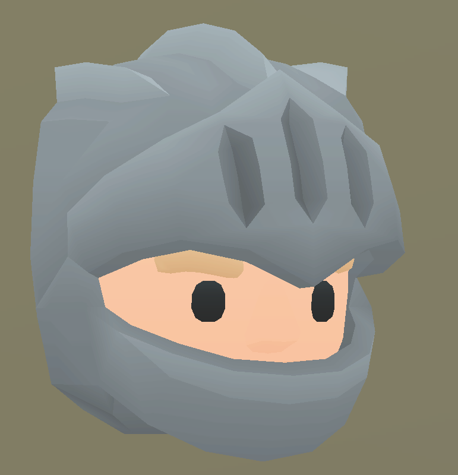

# 김윤성의 포트폴리오
안녕하세요, 게임 클라이언트 프로그래머를 지망하고 있는 김윤성이라고 합니다.   

어릴 적부터 게임은 제 삶의 큰 즐거움이자 영감을 주는 원천이었습니다.   
게임이 선사하는 행복과 아름다움에 매료되어 자연스럽게 게임 개발이라는 길을 선택하게 되었습니다.   
아직 부족한 점도 많지만, 끊임없이 배우고 성장하며 더 많은 사람들에게 기쁨과 감동을 전할 수 있는 게임을 만들고 싶습니다.    
그날까지 열정을 다해 노력하겠습니다.   
 

## About Me
**이름**   
  김윤성   
  
**학력**   
  2019.03 ~ 2025.02   
  서강대학교 컴퓨터공학과 졸업예정   
  
**기술 스택**   
  Unreal 5   
  Unity 5   
  C   
  C++   
  
 

---

 

## 팀 프로젝트
팀 단위로 진행한 게임 개발 프로젝트들을 기록하는 곳입니다.   
### 1. Project_HAL  
 
- **설명**:   
  Unity Game Engine을 이용하여 제작한 간단한 탑뷰 솔로플레이 2D 게임입니다.
- **주요 이미지**:   
  
  
  
- **More**:   
     
  

### 2. Squire   
 
- **설명**:   
  Unreal Game Engine을 이용하여 제작한 네트워크 기반의 3D 멀티플레이 게임입니다.
- **주요 이미지**:   
  
  
  
- **More**:   
     
  

 

---

 

## 개인 프로젝트   
수업을 듣거나 이론을 공부하며 진행한 개인 프로젝트들을 기록하는 곳입니다.   
### 1.  Concurrent Stock Server 
 
- **설명**:   
  C를 이용해 다중 Client의 요청을 처리하기 위한 Stock Server입니다.
- **주요 이미지**:   
  
  
  
- **More**:
  )
  
### 2. OpenGL 3D Viewing
 
- **설명**:   
  OpenGL을 이용해 3D 맵에서의 오브젝트 및 가상 카메라를 배치하고 움직임을 구현했습니다.
- **주요 이미지**:   
  
  
  
- **More**:
  )
 

---

 
## Contact   
- **E-Mail**   
  soundno07@naver.com   
- **Git**   
  soundno07@naver.com   
- **YouTube**   
  ![YouTube]https://www.youtube.com/@%ED%8F%89%EB%8B%A4%EB%B2%94
