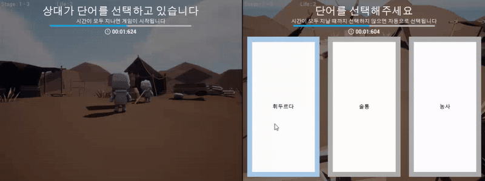

# Squire

## 프로젝트 소개
- **개발 기간**   
  2024.09.10 ~ 2024.12.06 (1차 빌드 완료)
- **개발 환경**   
  Unreal 5.2.1
- **프로젝트 목적**   
  게임 제작에 필요한 CS 지식을 확인하고 이를 바탕으로 실제 플레이 가능한 게임을 제작한다. 특히 Unreal Engine 5의 구조를 깊이 이해하고, 이를 활용하여 게임 플레이 구현에 필요한 다양한 프레임워크와
도구들을 적용해보는 것을 목표로 한다. 제작된 게임은 패키징 및 배포 과정을 거쳐 실제 서비스로 제공하며, 유저들에게 피드백을 받아 게임을 개선하는 경험도 포함한다.
- **주요 기술 및 도구**   
  - **Framework**: Unreal (C++, Blueprint)
  - **Network**: Replication, RPC
  - **UI**: UMG
- **멤버 구성**:
  - 기획 및 레벨 디자인 1명
  - 개발 1명
- **기여 내용**:
  - 역할: 개발
  - 내용: 폰 및 액터의 제작, 네트워크 제어, UI 제작, 게임 플레이 구현
  - 기여율: 개발 100%

<br>

---

<br>

## 프로젝트 구조
```plaintext
├── Source/
│   ├── Project_S.h
│   ├── Project_S.cpp                       # 커스텀 로그 카테고리 선언
│   ├── PS_AnimInstance.h
│   ├── PS_AnimInstance.cpp                 # 폰의 상태에 대해 폰의 Transform 및 애님 블루프린트를 제어
│   ├── PS_BaseGrabUp.h
│   ├── PS_BaseGrabUp.cpp                   # 월드에 배치할 수 있는 액터로, 폰이 Grab하면 폰의 시선 방향에 액터가 고정됨
│   ├── PS_BasePickup.h
│   ├── PS_BasePickup.cpp                   # (미사용) 월드에 배치할 수 있는 액터로, 폰이 overlap하면 폰의 손에 무기로 장착됨
│   ├── PS_Character.h
│   ├── PS_Character.cpp                    # 유저가 직접 조종하는 폰으로, 키 바인딩과 같이 유저의 특정 행동에 대해 폰을 제어
│   ├── PS_Enemy.h
│   ├── PS_Enemy.cpp                        # (미사용) AI에 의해 월드를 돌아다니는 폰으로, 유저를 발견하면 추적함
│   ├── PS_GameInstance.h
│   ├── PS_GameInstance.cpp                 # 게임 전체에서 일정하게 동기화 되어야 하는 변수들(Map, Stage, Life)의 값을 저장
│   ├── PS_GameMode.h
│   ├── PS_GameMode.cpp                     # 게임의 규칙을 선언하고 게임의 흐름을 제어
│   ├── PS_GameState.h
│   ├── PS_GameState.cpp                    # 게임의 현재 상태를 저장하고 서버와 클라이언트 간에 상태를 동기화
│   ├── PS_Grabable.h                       # PS_BaseGrabUp 클래스의 인터페이스
│   ├── PS_HUD.h
│   ├── PS_HUD.cpp                          # UI와 GameState 간의 상태를 동기화하고 PlayerController의 행동에 대해 UI를 제어
│   ├── PS_Interactable.h                   # (미사용) BP_Interactable 클래스의 인터페이스
│   ├── PS_MainMenuPawn.h
│   ├── PS_MainMenuPawn.cpp                 # 메인 메뉴에 사용하는 폰
│   ├── PS_PlayerController.h
│   ├── PS_PlayerController.cpp             # 유저의 입력을 처리하고 UI와 Session을 관리
│   ├── PS_PlayerState.h
│   ├── PS_PlayerState.cpp                  # 클라이언트의 상태(SelectedWord)를 저장하고 서버와 클라이언트 간에 상태를 동기화
│   ├── PS_TimeUtility.h
│   ├── PS_TimeUtility.cpp                  # 블루프린트의 커스텀 노드를 선언 및 정의
│   ├── PS_Words.h                          # DataTable의 Row를 커스텀으로 정의하기 위한 구조체
├── Content/
│   ├── Blueprints/
│   │   ├── Grabup/
│   │   │   ├── BP_Grabup.uasset            # PS_BaseGrabUp을 상속 받는 Base 애셋
│   │   │   ├── BP_Grabup_*.uasset          # BP_Grabup을 상속 받아 구현한 애셋들
│   │   ├── Pickup/
│   │   │   ├── BP_Pickup_Weapon.uasset     # (미사용) PS_BasePickup을 상속 받는 Base 애셋
│   │   │   ├── BP_Pickup_*.uasset          # (미사용) BP_Pickup_Weapon을 상속 받아 구현한 애셋들
│   │   ├── UI/
│   │   │   ├── MainMenu/
│   │   │   │   ├── WB_MainMenu_*.uasset    # 메인 메뉴에서 사용하는 UI들
│   │   │   ├── Session/
│   │   │   │   ├── WB_Session_*.uasset     # 세션 메뉴에서 사용하는 UI들
│   │   ├── WB_*_HUD.uasset                 # 게임 내에서 사용하는 UI들
│   ├── Inputs/
│   │   ├── IA_*.uasset                     # 각 Action에 대한 값과 트리거를 설정
│   │   ├── IMC_Default.uasset              # InputAction과 키를 매핑
```
                              
<br>

---

<br>

## 주요 기능 및 구조도
### 1. 게임 Session 생성 및 참가   
  
- **설명**: Host가 Host Game 버튼을 눌러 게임 Session을 생성하고, 다른 유저는 Find Session 버튼을 눌러 생성된 게임 Session을 검색한다. 참가하고자 하는 Sesison에 Join Session 버튼을 눌러 참가할 수 있다.
- **주요 기술**: UMG와 블루프린트를 이용한 MainMenu UI와 Session UI 제작
- **구조도**:
  

### 2. 캐릭터 시선 처리  
  
- **설명**: 마우스로 캐릭터의 시선을 조종할 수 있다. 이때 일정 각도 이상으로 캐릭터의 고개가 회전하면 몸통이 따라 움직이게 된다. 또한 카메라와 캐릭터 사이의 거리가 일정 이하로 가까워지면 캐릭터의 투명도가 증가해 시야를 넓힌다.
- **주요 기술**: RPC를 활용한 캐릭터의 Rotator 동기화
- **구조도**:
  

### 3. 게임 흐름 제어와 데이터 동기화   
  
- **설명**: 한 유저가 단어를 선택하면 선택한 단어를 기억한다. 그리고 일정 시간 이후 다른 유저가 제시어를 유추하는데, 이때 선택한 단어와 유추한 단어가 일치하면 정답으로 판정하고 다음 스테이지를 진행한다. 일치하지 않으면 오답으로 판정하고 Life를 차감한다. 이 과정에서 유저 간 데이터가 동기화 되어야 한다.
- **주요 기술**: GameMode를 통한 게임 흐름 제어, 변수 Replication을 통한 데이터 동기화
- **구조도**:
  

<br>

---

<br>

## 이슈 및 해결 과정
### 1. 이슈 1   
  
- **문제**: 이슈 1 설명
- **해결 과정**:
  1. `file.cpp` 과정 1
  2. `file.cpp` 과정 2
     ```c++
     // this is c++ code.
     ```

### 2. 이슈 2
  
- **문제**: 이슈 2 설명
- **해결 과정**:
  1. `file.cpp` 과정 1
  2. `file.cpp` 과정 2
     ```c++
     // this is c++ code.
     ```

### 3. 이슈 3
  
- **문제**: 이슈 3 설명
- **해결 과정**:
  1. `file.cpp` 과정 1
  2. `file.cpp` 과정 2
     ```c++
     // this is c++ code.
     ```

<br>

---

<br>

## 데모
- **YouTube 링크**:   
  [](https://www.youtube.com/watch?v=AIy8zwr5r8M)
